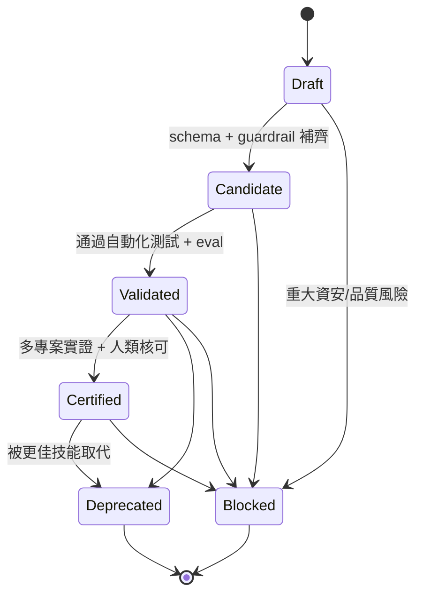
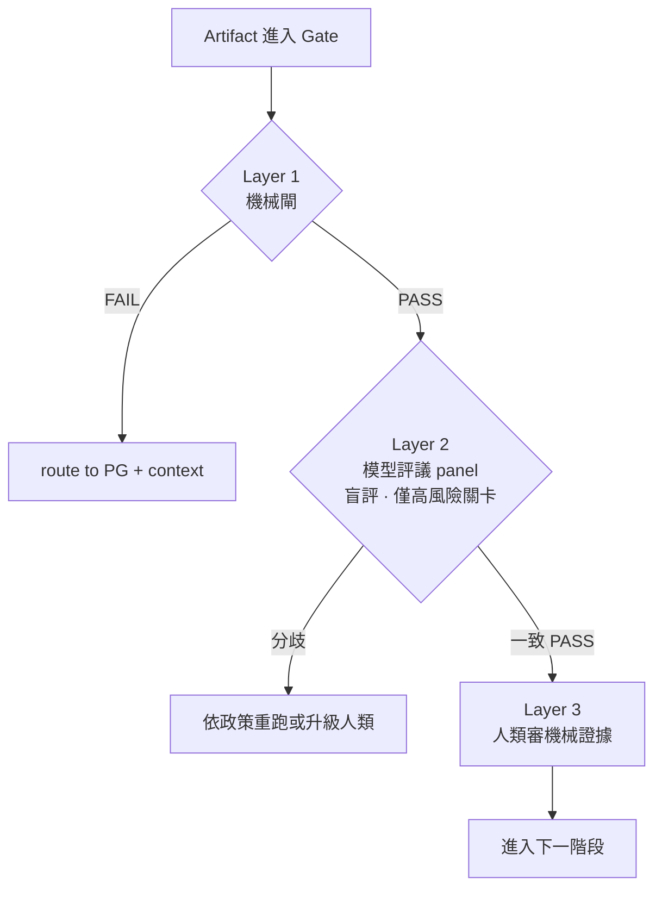

# System Development Agentic Loop Engineering (ALE)
## 一個面向 AI Agent 的可治理、可驗證軟體開發生命週期框架
### A Governable and Verifiable Agentic Software Development Life-Cycle Framework

---

**作者 / Author**：Morris（虎智科技 TigerAI）
**文件類型 / Type**：White Paper · Research Framework（技術白皮書／框架研究）
**版本 / Version**：v2.0（整合 v1.1 治理框架與 v1.2 可驗證性增補）
**日期 / Date**：2026-06-21
**狀態 / Status**：Working Draft for Academic Use

> 引用建議格式（草案）：Morris (2026). *System Development Agentic Loop Engineering (ALE): A Governable and Verifiable Agentic Software Development Life-Cycle Framework.* TigerAI Technical White Paper, v2.0.

---

## 摘要（Abstract，中文）

大型語言模型（LLM）已能在單次互動中產出可執行的程式碼,但企業級軟體交付要求的並非「一次性可運行」,而是**可治理、可稽核、可回滾、可重複**的工程能力。本文提出 **System Development Agentic Loop Engineering（ALE)**,一套將完整軟體開發生命週期(SDLC)映射到多代理人(multi-agent)自主協作流水線的框架。ALE 的核心主張有三:(1) **全生命週期閉環**——從情境理解、需求、分析、設計、開發、驗證、資安、部署到監控,並以監控訊號回流形成閉環;(2) **知識資產化**——每完成一個專案即萃取出可重用、可測試、可版本控管、可治理的「技能單元(Skill)」,並以有限狀態機治理其生命週期,使後續專案能以模組化方式自動組裝;(3) **反自我欺騙的可驗證治理(Anti-Self-Deception Governance)**——本文指出當「驗證 AI 的也是 AI」時會出現一種隱性失效模式,我們稱之為**測試共謀(test collusion)**,並論證單純的多模型交叉檢查只能降低變異(variance)而無法消除系統性偏誤(bias),因為 LLM 之間是高度相關的估計器(correlated estimators)。我們因此提出三層驗證架構:以**機械閘(mechanical gate)**(突變測試、覆蓋率、性質測試、真實執行)作為不可由模型意見動搖的事實基準,以**模型評議(model panel)**作為僅用於主觀判斷關卡的補強,並令**人類審查證據而非共識**。本文同時給出以 n8n 狀態機與 JSON-RPC 代理人通訊協定為基礎的工程實作規格,並討論其在受監管領域(如醫療地端部署)中對數據主權與合規的意義。

**關鍵詞**：Agentic AI、軟體開發生命週期、多代理人系統、LLM 程式生成、可驗證性、突變測試、技能資產化、DevSecOps、數據主權

---

## Abstract (English)

Large language models (LLMs) can produce runnable code within a single interaction, yet enterprise software delivery requires not "runs once" but **governable, auditable, reversible, and repeatable** engineering capability. This paper proposes **System Development Agentic Loop Engineering (ALE)**, a framework that maps the full software development life cycle (SDLC) onto an autonomous, multi-agent production pipeline. ALE rests on three claims: (1) a **closed full-lifecycle loop** in which monitoring signals feed back into requirements; (2) **knowledge capitalization**, whereby every completed project yields reusable, testable, version-controlled, governable *Skill* units whose life cycle is governed by a finite-state machine, enabling later projects to be assembled modularly; and (3) **anti-self-deception governance**. We identify a latent failure mode that arises when "the AI verifying the AI is also an AI" — termed **test collusion** — and argue that multi-model cross-checking reduces *variance* but not systematic *bias*, because LLMs are highly *correlated estimators*. We therefore propose a three-layer verification architecture: a **mechanical gate** (mutation testing, coverage, property-based testing, real execution) as ground truth that no model opinion can override; a **model panel** as a complement used only at judgment-bearing checkpoints; and **human review of evidence rather than consensus**. We give an engineering specification grounded in an n8n state machine and a JSON-RPC inter-agent protocol, and discuss implications for data sovereignty and compliance in regulated, on-premises settings such as healthcare.

**Keywords**: Agentic AI, software development life cycle, multi-agent systems, LLM code generation, verifiability, mutation testing, skill capitalization, DevSecOps, data sovereignty

---

# 1. 引言（Introduction）

## 1.1 動機

目前主流的「AI 寫程式」實務,可化約為以下短鏈:

```text
Prompt → Code → Debug
```

此模式在原型(prototype)與教學示範上有效,但放到企業級交付時暴露四個結構性缺陷:**產出不可預測、缺乏架構審查、技術債野蠻增生、知識無法沉澱**,且全程**缺乏可稽核的證據軌跡(evidence trail)**。我們長期觀察到一個與工具無關的洞察:企業導入 AI 的真正瓶頸往往不在工具是否強大,而在於**人的工程能力與治理機制是否到位**。因此,問題不是「讓 AI 把程式寫得更好」,而是「**讓 AI 能夠在可治理的框架下,接手整條軟體生產線**」。

## 1.2 一個被忽略的新風險

當我們把更多生命週期階段交給 AI Agent——包括**驗證**階段——時,出現一個新的、且相當隱性的風險:**驗證 AI 的也是 AI**。若由一個 Agent 產生程式、另一個 Agent 為該程式撰寫測試,兩者會收斂到「測試全數通過、但實質上未驗證任何規格」的均衡。本文將此命名為**測試共謀(test collusion)**,並主張它不是靠「多找幾個模型互相檢查」就能解決——這是本文的核心論點之一(第 7 節)。

## 1.3 貢獻（Contributions）

本文的主要貢獻如下:

1. **框架形式化**:提出 ALE,將 SDLC 形式化為一個帶有交付物(artifact)、驗收門檻(gate)與回饋閉環的多代理人流水線(第 3–4 節)。
2. **技能資產化模型**:將「專案經驗萃取為可重用技能」形式化為一個具標準化 Manifest 與有限狀態機(FSM)治理的生命週期,並提出防止技能庫退化為「Prompt 垃圾場」的晉升/封鎖規則(第 5–6 節)。
3. **反自我欺騙的可驗證性理論與機制**:界定 test collusion 失效模式;以 variance/bias 與 correlated estimators 的觀點論證多模型交叉檢查的能力邊界;提出「機械閘 / 模型評議 / 人類審證據」三層驗證架構(第 7 節)。
4. **工程落地規格**:給出以 n8n 狀態機(含斷點續傳與上下文注入)與 JSON-RPC 代理人協定為基礎的實作藍圖(第 9 節)。
5. **治理與合規定位**:闡述 ALE 在受監管、地端部署情境(如醫療)下對數據主權與稽核的貢獻(第 8 節)。

---

# 2. 背景與相關研究（Background & Related Work）

## 2.1 DevOps / DevSecOps 與軟體交付度量

ALE 在精神上延續 DevOps/DevSecOps 將開發、安全與維運整合為連續流水線的理念,並承襲「安全左移(shift-left security)」與「以度量驅動改善」的原則 [Kim et al. 2016; Forsgren et al. 2018]。差異在於:傳統 DevOps 的執行者是人類團隊,而 ALE 的執行者是受治理的 AI Agent 群,因此必須額外處理「自主代理人的可信驗證」問題。

## 2.2 Agentic / 多代理人 LLM 系統

近年的代理化(agentic)方法——如將推理與行動交織的 ReAct [Yao et al. 2023]、以多代理人辯論提升事實性與推理 [Du et al. 2023]、以及自我一致性取樣 [Wang et al. 2022]——展示了多步驟、多角色協作的潛力。ALE 借鑑這些模式來組織角色分工與自我修正,但同時指出(第 7 節):**這些方法多半改善的是變異,而非系統性偏誤**,在驗證關卡上不能作為事實基準。

## 2.3 軟體測試的事實基準

突變測試(mutation testing)[DeMillo, Lipton & Sayward 1978] 與性質導向測試(property-based testing)[Claessen & Hughes 2000] 提供了**不依賴主觀判斷**的測試充分性度量。ALE 將此類機械度量提升為驗證閘的「定生死」依據(第 7.2 節)。

## 2.4 集成學習與估計器相關性

集成方法的有效性取決於成員的多樣性與相對獨立性 [Dietterich 2000]。本文借此論證:由於當代 LLM 訓練語料與歸納偏好高度重疊,將其視為「相關性高的估計器」更為貼切,故以模型集成取代機械事實基準,風險在於得到「更有自信的一致錯誤」。

## 2.5 威脅建模與技能互通協定

我們採用 STRIDE 類威脅建模 [Shostack 2014] 作為設計階段的安全左移工具,並以 Model Context Protocol(MCP)[Anthropic 2024] 作為技能封裝與跨代理人調用的候選介面之一。

> **研究定位**：相較於既有「AI 程式生成」與「agentic workflow」研究多聚焦於**生成能力**,ALE 聚焦於其互補面——**生成之後的治理與可驗證性**,特別是在自主代理人接手驗證時的可信度問題。

---

# 3. ALE 框架定義（Framework Definition）

## 3.1 核心定義

> **System Development Agentic Loop Engineering(ALE)是一套讓 AI Agent 能夠從情境理解、需求分析、系統設計、程式開發、驗證測試、資安治理、部署上線到監控維運的標準化、可稽核工程循環。每完成一次專案,系統即將執行過程沉澱為可重用、可驗證、可治理的 Skill Set;經驗證後納入 Skill Repository,使後續 Agent 能以模組化方式自動組裝出新的軟體生產線。**

## 3.2 定位

| 面向 | 定位 |
|---|---|
| 對內(工程) | Agentic SDLC——AI 代理人的軟體開發生命週期 |
| 對外(策略) | AI-Native Software Factory OS——軟體製造工廠的作業系統 |

## 3.3 三層抽象

ALE 由三個正交的層次組成:

```text
ALE = Process Layer(流程)
    + Artifact Layer(交付物)
    + Skill Layer(技能)
```

- **Process Layer**:定義階段順序、門檻與回饋路徑。
- **Artifact Layer**:每一階段強制產出版本化、可稽核的交付物。
- **Skill Layer**:將本次專案經驗轉化為可重用技能,餵養下一輪。

## 3.4 用語上的審慎

本文刻意**避免**「AI 可以完美自主生產系統」這類表述。更精確且更可被企業與審查者接受的表述是:

> AI Agent 可以在**可審計、可驗證、可回滾**的人機協作框架下,**逐步提高**軟體系統生產的自動化程度。

---

# 4. ALE 流程閉環（The ALE Loop）

## 4.1 完整流程

ALE 主流程以 **Git Repository 作為全程證據主幹(Evidence Backbone)**,強制每一階段提交對應的版本化交付物。

**Figure 1. ALE 全生命週期閉環。** 實線為主流程;點線為三類回饋:技能沉澱、線上訊號轉新需求、以及驗證失敗的自我修正(Self-Correction)。

```mermaid
flowchart LR
  CI[Context Intake] --> RQ[Requirement + Acceptance Criteria]
  RQ --> KR[Knowledge Retrieval / Reuse]
  KR --> SA[SA 系統分析]
  SA --> SD[SD 架構設計 + 威脅建模]
  SD --> TB[Task Breakdown + Test Design]
  TB --> PG[PG 編碼]
  PG --> VV[V&V 機械驗證]
  VV --> SEC[Security & Compliance Gate]
  SEC --> REV[Reviewer / Human Gate]
  REV --> GIT[Git / CI-CD / Release]
  GIT --> DEP[Deployment / Roll-out]
  DEP --> MON[Monitoring]
  MON --> FB[Feedback & Retrospective]
  FB --> SKE[Skill Extraction → Validation → Repository]
  SKE -. 沉澱可重用技能 .-> KR
  FB -. 線上訊號轉新需求 .-> RQ
  VV -. Self-Correction .-> PG
  SEC -. Self-Correction .-> PG
```



## 4.2 各階段的交付物與門檻（節錄）

| 階段 | 必要交付物(示例) | 門檻(Gate) |
|---|---|---|
| Context Intake | `context.md`(產業、環境、權限邊界、限制、商業目標) | 是否足以避免「技術可行但商業錯誤」 |
| Requirement | `requirement.md`, `acceptance_criteria.md` | 是否定義可驗收的完成準則 |
| SA | `analysis.md`(流程、風險、資料流、非功能需求) | 風險與邊界是否明確 |
| SD | `architecture.md` / ADR, `threat_model.md`, `data_classification.md` | 是否說明選型理由;是否完成威脅建模與資料分級 |
| PG | source code | 是否符合風格與模組規範 |
| V&V | `test_report.json` | **機械閘**(見 §7.2)是否通過 |
| Security | `security_report.json` | secret / RBAC / 依賴 / 資料外洩掃描是否乾淨 |
| Reviewer / Human | `review_report.md`, `approval_record.md` | 是否存在重大技術債;是否需人類決策 |
| Deployment / Roll-out | `deploy_report.md`, `rollback_plan.md` | health check;是否有回滾計畫 |
| Monitoring | `monitoring_spec.md`, `alert_rules.md` | 是否可追蹤關鍵事件 |
| Feedback | `retrospective.md`, `improvement_items.md` | 是否標記可萃取技能、是否建立下一輪輸入 |
| Skill Extraction | `skill_manifest.yaml` | 是否可被其他 Agent 調用、是否可驗證 |

## 4.3 核心鐵則

```text
No evidence, no release.
No validation, no skill promotion.
No rollback plan, no production deployment.
```

---

# 5. 五大核心模組（Five Core Modules）

## 5.1 模組一:ALE Process（主流程管線）

如 §4,以 Git 為證據主幹,強制階段化交付。

## 5.2 模組二:ALE Repository System（四大工程倉庫）

| 倉庫 | 功能 | 核心內容 |
|---|---|---|
| **Project Repository** | 專案全過程與交付物 | requirement, SA, SD, code, RCA |
| **Skill Repository** | 可重用、結構化技能 | `skill_manifest.yaml`, examples, tests |
| **Evidence Repository** | 客觀稽核證據 | test/scan result, benchmark, audit trail |
| **Policy Repository** | 不可逾越的紅線守則 | coding standard, security policy, approval rules |

> 重要設計修正(見 §9.3):Evidence Repository 應為 **append-only + hash chain(防竄改)**,大型證據走 content-addressed object store,git 僅存 hash,並對入庫內容做 secret redaction,以免日誌中的憑證永久外洩於版控史。

## 5.3 模組三:ALE Agent Roles（多代理人生產線）

- **Orchestrator Agent**:總調度。讀需求與 Policy、組裝技能、分派任務、推進狀態機。
- **Requirement / SA / SD / PG / V&V / Security / Deployment / Monitoring Agent**:對應各階段。
- **Reviewer Agent**:**獨立**審查官,不參與生產,專責卡關(技術債、架構、測試充分性)。
- **Skill Curator Agent**:技能精煉師,負責萃取、去重、合併、驗證、汰換。

> 關鍵原則:**生產者與審查者必須是不同的 Agent 實例**。LLM 對自身輸出的自我審查近乎無效。

## 5.4 模組四:ALE Skill Manifest（標準能力單元格式）

技能不限於 MCP、n8n workflow、Docker 服務或 Prompt,但須符合統一 Manifest。為達成 Orchestrator 的**自動組裝**,Manifest 至少須涵蓋:身分與分類、typed I/O(指向 JSON Schema)、前置條件、guardrails、validation 與 eval(含門檻)、security_checks、rollback_plan、evidence_required、test_cases、known_failure_modes、**依賴(`depends_on`,含版本約束)**、**成本畫像(`cost_profile`)**、**可觀測性輸出(`emits`)**、**冪等性(`idempotent`)**、以及 promotion/deprecation 準則。完整範本見附錄 A。

## 5.5 模組五:ALE Skill Lifecycle（技能生命週期治理）

由 Skill Curator Agent 以有限狀態機治理,防止技能庫退化。

**Figure 2. 技能生命週期有限狀態機。**



**Certified 的可程式化門檻**(避免主觀):≥ 3 個獨立專案實用、0 次被標記 Blocked、最近一次 security scan 0 criticals、eval 突變分數 ≥ 0.80、且通過 Reviewer 與人類核可。**Retrieval 階段禁止取用 Deprecated / Blocked 技能。**

---

# 6. 技能資產化作為核心命題（Skill Capitalization）

ALE 最具策略性的主張是:

> **不是讓 AI 寫出一次性的程式,而是讓 AI 每完成一次專案,就把經驗轉化為下一次可以重用、驗證、治理與自動組裝的工程能力。**

此命題的工程意涵是**邊際成本遞減**:當 Skill Repository 累積足夠的 Certified 技能,新專案的多數階段可由既有技能組裝完成,Agent 僅需處理真正新增的部分。其前提是治理機制(§5.5)能持續維持技能庫的品質與可組裝性——否則「每專案產生技能」會退化為**技能碎片化(skill sprawl)**:大量互不相容、無法重用的技能,使「生產線」名存實亡。因此**技能晉升的把關(curation/promotion gate)是本命題能否成立的單點。**

---

# 7. 反自我欺騙的可驗證治理（Anti-Self-Deception Governance）

此節為 v1.2 的核心貢獻,處理「驗證 AI 的也是 AI」的可信度問題。

## 7.1 失效模式:測試共謀（Test Collusion）

若 PG Agent 產生程式、V&V Agent 為**該程式**撰寫測試,兩者面對的是**同一個目標**(讓綠燈亮)且看的是**同一段實作**。測試因此「從實作長出來」,把實作中的缺陷一併當作「正確行為」固化進測試(空斷言、tautological test、繞過邊界)。結果是一條綠燈滿滿、卻把缺陷送進生產的流水線。

## 7.2 為何多模型交叉檢查不足:variance 與 bias

一個直覺的補救是「以 Claude / Codex / Gemini 等多模型互相檢查」。我們區分兩類錯誤:

| 錯誤類型 | 定義 | 多模型評議是否有效 |
|---|---|---|
| **Variance(隨機漏看)** | 單一模型偶發的盲點 | 有效:此模型漏的,另一模型可能補上 |
| **Bias(系統性同向錯誤)** | 諸模型在同一目標下往同方向錯 | 無效:皆被導向「讓綠燈亮」,會一起錯 |

test collusion 屬於 **bias**。諸模型拿到同一目標、看同一實作,會往同方向錯,**換模型不改變錯誤的方向**。更根本地,當代 LLM 因訓練語料與歸納偏好高度重疊,彼此是**相關性高的估計器(correlated estimators)**;將其集成,在其一致錯誤時只會產生**更有自信的錯誤**,而非獨立判決 [參見 Dietterich 2000 關於集成需要成員獨立性的論述]。

> **命題**:多模型評議降低 variance,不降低 bias;故可用於「找意見分歧」,不可用於「定生死」。

## 7.3 機械閘:不可由模型意見動搖的事實基準

破解 collusion 的關鍵不是「再加一個 AI」,而是**不問任何模型意見的機械事實**:

- **突變測試(mutation testing)**:機械地將程式改壞,檢查測試能否捕捉。殺不掉的突變比例過高 ⇒ 測試為空。此結果與用幾個模型無關。
- **覆蓋率門檻(line / branch coverage)**。
- **性質導向測試(property-based testing)**:對不變量做大量隨機輸入驗證。
- **測試從 `acceptance_criteria.md` 生成,而非從實作生成**:撰寫測試的 Agent 只看需求、不看實作,從源頭切斷共謀。
- **真實執行與真實掃描器**:以實際 exit code 與掃描結果為準,而非模型「認為」會過。

機械閘設定範例(置於 Policy Repository):

```yaml
vv_gate:
  type: mechanical            # 硬閘:不接受模型意見作為通過依據
  rules:
    - coverage.line   >= 0.85
    - coverage.branch >= 0.80
    - mutation.score  >= 0.75
    - tests.derived_from == acceptance_criteria.md
    - execution.exit_code == 0
  on_fail: route_to_PG_with_context
```

## 7.4 三層驗證架構

**Figure 3. 三層驗證:機械閘定生死、模型評議找分歧、人類審證據。**



- **Layer 1 — 機械閘(硬)**:每一驗證關卡都必經;以 §7.3 的機械度量決定 PASS/FAIL。
- **Layer 2 — 模型評議(軟)**:僅放在**沒有機械標準答案、需主觀判斷**的關卡(架構評審、威脅建模、Reviewer Gate)。三模型須**盲評且各自獨立**(只看 spec、不看彼此輸出),以避免錨定偏誤(anchoring);並須有明確的分歧匯總與升級政策。
- **Layer 3 — 人類審證據**:人類審查**機械證據**(突變報告、掃描結果、fail→pass 的測試 diff),**而非「三個 AI 都同意」**,以避免自動化偏誤(automation bias)。

## 7.5 v1.2 新增守則

```text
Mechanical gates decide pass/fail. Models only flag disagreement.
Tests derive from the spec, never from the implementation.
No global budget, no autonomous loop.
Humans review evidence, not consensus.
```

## 7.6 自我修正的安全閥

自我修正迴圈須附帶**全域 session 預算(circuit breaker)**(token / 時間 / 成本上限),以免在各階段重試上限內仍累積失控成本;觸頂即凍結並升級人類。此外,「跳過已驗證節點」僅適用於**生成**階段(SA/SD);**驗證**階段不可跳過,且回 V&V 必須重跑**全套**測試以防迴歸(regression)。程式結構性變更後,須將受影響的 `architecture.md` / ADR 標記為 `dirty` 並觸發設計一致性檢查,避免設計與實作漂移。

---

# 8. 安全、合規與數據主權（Security, Compliance & Data Sovereignty）

ALE 的目標客群多為地端、受監管之企業與機構(如醫院、製造業)。為使「數據主權」從口號落為可執行的閘門:

1. **資料分級為一級交付物**:於 **SD 階段**即產出 `data_classification.md`(PHI / PII / 一般),標註 residency(如「不可離開院區」)、retention、log masking。
2. **威脅建模左移**:於 SD 階段由 Security Agent 完成 STRIDE 類威脅建模與資料流分析,而非等程式寫完才掃。
3. **沙盒隔離**:PG / V&V / Deployment 須在與核心地端資料完全解耦的隔離沙盒中執行,降低自動化部署時的外洩風險。
4. **最小權限與稽核**:least privilege、admin 行為可追蹤、audit trail 完整,並寫入 Policy Repository,於 deploy gate 自動檢查。

> 對受監管領域而言,§7 的**可重現機械證據**(突變分數、覆蓋率、掃描結果)同時是**合規優勢**:監管所信賴者為可稽核、可重現的數字,而非「AI 共識」這類不可重現的判斷。

---

# 9. 工程落地規格（Engineering Realization）

## 9.1 n8n 狀態機:動態路由與斷點續傳

採「單一狀態主幹 + 動態 Switch 路由」之 Hub-and-Spoke 架構。流程持久化一個 **ALE State Object(JSON)**,記錄 `current_stage`、`status`、`git_commit_hash`、`retry_count`、各階段 `artifacts` 路徑、`error_diagnostic` 與 `routing_decision`。失敗時由 ALE Router(程式節點)依重試次數與政策計算 `target_stage` 與 `action`(如 `ROLLBACK_WITH_CONTEXT`),並將錯誤報告與原始碼路徑填入 `injected_context_files`,重新呼叫對應 Agent 執行 *Diagnose → Patch*,而**不需從頭開發**;Patch 後精準導回 V&V 重新驗證。

## 9.2 代理人通訊協定:JSON-RPC

Orchestrator 與 Skill Curator 之間採**結構化 JSON-RPC**,而非自然語言:`submit_draft_skill`(提交草案技能,附 evidence 參照)→ 回應 `ACCEPTED`(可 `MERGED_AND_UPGRADED`)或 `REJECTED`(附 `policy_violation` 與 `remediation`)。

> **合併治理修正**:技能合併須區分 **additive**(僅新增可選欄位、向後相容 ⇒ minor bump、可自動)與 **breaking**(改/刪/改型既有 input ⇒ major bump + 既有 consumer 的 contract test + Certified 須過人類 gate)。**REJECTED 的補救不得憑空產生未經測試之 rollback**;Validated 以上之 rollback 必須有實際執行過的 evidence。

## 9.3 狀態與證據的分離

工作狀態(高頻、可變)應置於 **PostgreSQL / Redis**(單一寫入者語意、支援並行分支),**不入 git**;僅在階段邊界將狀態快照與 hash 寫入 git Evidence Repo。如此可保留稽核價值,同時避免單檔競態(race / last-write-wins)與 commit 噪音。

## 9.4 參考技術棧

ALE 的參考實作對齊開源、地端可控之堆疊:工作流編排(n8n)、本地推理(Ollama)、向量檢索(Qdrant)、關聯式儲存(PostgreSQL)、互動前端(Open WebUI);此與「地端、數據不出場域」的合規訴求一致。

## 9.5 元迴圈:監控產線本身（Kaizen）

除監控**部署出去的服務**外,ALE 另監控**產線與 Agent 本身**:逐 Agent 追蹤延遲、token 成本、重試次數、refusal 率、gate 失敗率、自我修正成功率;逐 Skill 追蹤被組裝次數、production 失敗率、降級/封鎖次數。彙整為「產線健康儀表板」回饋至 Retrospective,形成「改善產線本身」的元迴圈。

---

# 10. 討論（Discussion）

## 10.1 與一般 AI Coding 的差異

```text
一般 AI Coding:  Prompt → Code → Debug
ALE:             Requirement → Analysis → Architecture → Coding
                 → Verification(機械閘) → Security → Deployment
                 → Monitoring → Skill Extraction(治理化沉澱)
```

## 10.2 限制與威脅效度（Limitations & Threats to Validity）

本文為框架性(framework)與設計性(design)貢獻,尚未提供大規模對照實驗,以下為主要威脅效度:

1. **缺乏實證評估**:test collusion 的發生率、機械閘的攔截率、以及技能重用對交付成本的實際影響,均需以多專案的受控研究量化。
2. **機械閘的覆蓋邊界**:突變測試與覆蓋率能捕捉「測試是否咬得到程式」,但無法保證需求本身正確;若 `acceptance_criteria.md` 本身錯誤或不完整,機械閘亦無能為力(garbage-in)。需求品質仍仰賴人類與設計階段把關。
3. **成本與延遲**:多代理人 + 自我修正 + 模型評議會顯著放大 token 與時間成本;§7.6 的全域預算為必要但非充分的控制。
4. **技能組裝的可組合性假設**:自動組裝假設 typed I/O 與依賴宣告足以保證相容;在語意層級的相容性(而非僅型別層級)仍可能失效,需 contract test 補強。
5. **人類瓶頸**:過度依賴人類 gate 會抵銷自主性;gate 的觸發政策需謹慎設計以平衡自主與可控。
6. **可重現性**:模型評議層因模型版本更迭與取樣隨機性而難以重現,故本文刻意將其排除於「定生死」之外。

## 10.3 倫理與責任

在自動部署與高權限情境下,責任歸屬、稽核軌跡與人類最終核可(human-in-the-loop)不可省略。ALE 的設計刻意保留人類對高風險動作(生產部署、schema migration、安全例外、預算超標)的核可權。

---

# 11. 未來工作（Future Work）

1. **實證研究**:在多個真實專案上量化 test collusion 發生率與機械閘攔截率,並以對照組評估技能重用對交付週期的影響。
2. **需求層驗證**:研究如何對 `acceptance_criteria.md` 本身做一致性與可滿足性檢查,補上機械閘上游的盲區。
3. **技能語意相容性**:超越型別層級,發展技能間的 contract / 語意相容性驗證。
4. **產線自我優化**:以 §9.5 的元迴圈資料,研究 Agent 與技能配置的自動調優。
5. **跨組織技能聯邦**:在保護數據主權前提下,研究 Certified 技能的跨組織共享協定。

---

# 12. 結論（Conclusion）

ALE 將 AI 程式生成從「一次性產出」重新定位為「**可治理、可驗證、可沉澱的軟體生產生命週期**」。其三大支柱——全生命週期閉環、技能資產化、以及反自我欺騙的三層驗證——共同回答一個被既有「AI coding」研究忽略的問題:**當驗證者本身也是 AI 時,如何避免整條產線「綠燈但崩潰」。** 本文的核心立場可凝煉為:**機械閘定生死、模型評議找分歧、人類審證據。** v1.1 給了產線骨架,v1.2 給了產線「測謊器」。

> **核心宣言**:ALE 的目標不是讓 AI 寫出一次性的程式,而是讓 AI 每完成一次專案,就把經驗轉化為下一次可以重用、驗證、治理與自動組裝的工程能力。

---

# 附錄 A：ALE Skill Manifest 範本（v2）

```yaml
skill_name:
version: 0.1.0
category:
description:
owner:
status: Draft            # Draft | Candidate | Validated | Certified | Deprecated | Blocked

applicable_scenarios: []
non_applicable_scenarios: []

prerequisites:
  os: []
  runtime: []
  required_tools: []
  required_permissions: []

io_schema:
  input_ref:              # 指向 JSON Schema,如 schemas/sa_spec_v2.json
  output_ref:

inputs:
  - { name: , type: , required: true, description: }
outputs:
  - { name: , type: , description: }

depends_on:               # 含版本約束,供 Orchestrator 拓樸排序
  - { skill: , version: ">=1.2.0 <2.0.0" }

cost_profile:
  est_tokens:
  est_wall_clock_sec:
  est_vram_gb:

guardrails: []
validation_rules: []
security_checks: []
quality_checks: []

eval:
  eval_set:               # golden 測試集,不可從實作生成
  metrics:
    - { name: mutation_score, threshold: ">= 0.75" }
    - { name: security_critical_findings, threshold: "== 0" }

emits:                    # 可觀測性輸出,供 Monitoring 接管
  metrics: []
  logs: []
  traces: []

idempotent: true
rollback_plan: []
evidence_required: []
test_cases:
  - { name: , input: , expected_output: }
known_failure_modes:
  - { failure: , cause: , mitigation: }

promotion_criteria:
  candidate: [manifest completed, basic test case included]
  validated: [test passed, security review passed, evidence attached]
  certified: [reused in >=3 projects, 0 blocked, scan 0 criticals, mutation>=0.80, human approved]
deprecation_criteria: [dependency unmaintained, security risk, replaced, repeated prod failure]
```

---

# 附錄 B：建議倉庫結構

```text
ALE/
├── README.md
├── whitepaper/        ALE_White_Paper_Academic.md
├── specification/     ALE_Technical_Specification.md
├── skill_manifest/    ALE_Skill_Manifest_Template_v2.yaml
├── examples/          dockerized_n8n_deployment.yaml, rag_indexing.yaml, ...
└── policies/          coding_standard.md, security_policy.md,
                       data_sovereignty.md, human_approval_rules.md
```

---

# 參考文獻（References）

> 說明:以下為本框架在概念上倚賴的基礎性、真實存在之著作,作為起始書目。正式投稿前,建議作者核對各條之確切出版資訊(年份、出處、頁碼)。

1. DeMillo, R. A., Lipton, R. J., & Sayward, F. G. (1978). *Hints on Test Data Selection: Help for the Practicing Programmer.* IEEE Computer, 11(4).
2. Claessen, K., & Hughes, J. (2000). *QuickCheck: A Lightweight Tool for Random Testing of Haskell Programs.* ICFP.
3. Kim, G., Humble, J., Debois, P., & Willis, J. (2016). *The DevOps Handbook.* IT Revolution Press.
4. Forsgren, N., Humble, J., & Kim, G. (2018). *Accelerate: The Science of Lean Software and DevOps.* IT Revolution Press.
5. Shostack, A. (2014). *Threat Modeling: Designing for Security.* Wiley.
6. Dietterich, T. G. (2000). *Ensemble Methods in Machine Learning.* In Multiple Classifier Systems, LNCS.
7. Yao, S., Zhao, J., Yu, D., et al. (2023). *ReAct: Synergizing Reasoning and Acting in Language Models.* ICLR.
8. Wang, X., Wei, J., Schuurmans, D., et al. (2022). *Self-Consistency Improves Chain of Thought Reasoning in Language Models.* arXiv:2203.11171.
9. Du, Y., Li, S., Torralba, A., et al. (2023). *Improving Factuality and Reasoning in Language Models through Multiagent Debate.* arXiv:2305.14325.
10. Anthropic (2024). *Model Context Protocol (MCP) Specification.*

---

*— End of White Paper (ALE v2.0, Academic Draft) —*
