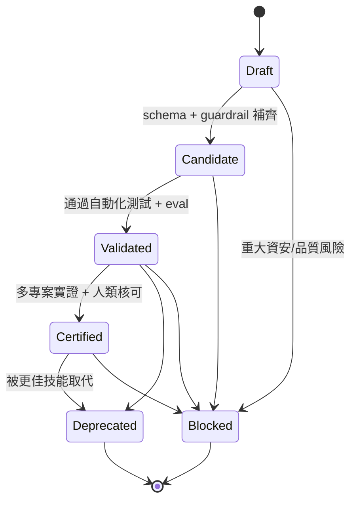
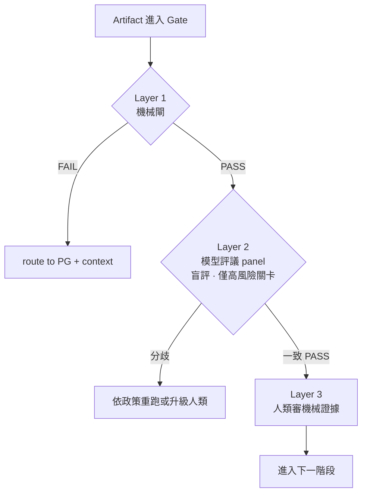
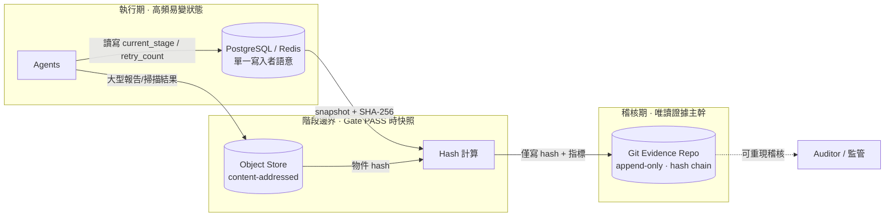

# System Development Agentic Loop Engineering (ALE)
## 一個面向 AI Agent 的可治理、可驗證軟體開發生命週期框架
### A Governable and Verifiable Agentic Software Development Life-Cycle Framework

---

**作者 / Author**：Morris（虎智科技 TigerAI）
**文件類型 / Type**：White Paper · Research Framework（技術白皮書／框架研究）
**版本 / Version**：v2.3（在 v2.1 基礎上,整合統計理論深化、需求不變量防禦、技能去退化演算法與 AI 特有威脅防禦）
**日期 / Date**：2026-06-21
**狀態 / Status**：Working Draft for Academic Use

> 引用建議格式（草案）：Morris (2026). *System Development Agentic Loop Engineering (ALE): A Governable and Verifiable Agentic Software Development Life-Cycle Framework.* TigerAI Technical White Paper, v2.3.

> **本文 ALE 一詞之界定（避免撞名）**：本文之「ALE」專指 *System Development Agentic Loop Engineering*。機器學習文獻中亦有 *Accumulated Local Effects (ALE)* 與資安領域之 *Annualized Loss Expectancy (ALE)*,與本文無關,特此聲明以免混淆。

---

## 版本沿革（Version Lineage）

```text
ALE v1.1：讓 Agent 接手 SDLC（產線骨架）
ALE v1.2：讓 Agentic SDLC 可驗證（機械閘 / 反共謀 / 三層驗證）
ALE v2.0：讓 Agentic SDLC 可治理、可稽核、可沉澱
ALE v2.1：讓主張可被研究驗證、且可作為企業治理框架落地
          （RQ / Evaluation Plan / Maturity Model / 權限模型 / 供應鏈安全 / 產線威脅模型）
ALE v2.3：讓統計理論、需求源頭防禦與 AI 特有威脅無懈可擊（審稿人攻防強化版）
```

## 相對 v2.1 的修訂摘要（Changelog v2.1 → v2.3）

本版**不推翻 v2.1 任何結論**,僅在三個維度做「審稿人攻防」級強化(來源:Gemini 深化建議):

| 項目 | 類型 | 位置 | 來源 |
|---|---|---|---|
| 條件協方差形式化 + 資料共用/RLHF 同質化論證(估計器為何相關) | 深化 | §7.2 | Gemini #1 |
| 需求不變量 / 蛻變關係（Spec Invariants / Metamorphic Relations）作為 Garbage-In 主動防禦 | 新增 | §7.7、§4.2 | Gemini #2 |
| Skill Curator 去退化演算法:語意重疊閾值 τ + AST 比對 + 合流回歸測試 | 新增 | §9.2.1 | Gemini #3 |
| AI 特有威脅:Prompt Injection / Agent Hijacking 的產線級防禦 | 新增 | §8.7 | Gemini #4 |
| 狀態/證據分離之架構視覺化（Figure 4） | 新增 | §9.3 | Gemini #5 |

> v2.1 已有之 RQ(§1.4)、Novelty(§1.5)、Scope(§3.5)、權限模型(§5.6)、供應鏈安全(§8.5)、產線威脅模型(§8.6)、機械閘成本工程(§9.6)、Evaluation Plan(§10)、Maturity Model(§11)、spec→test 殘留盲區(§12.2)、邊際成本 U 形(§6) 全數保留。

---

## 摘要（Abstract，中文）

大型語言模型（LLM）已能在單次互動中產出可執行的程式碼,但企業級軟體交付要求的並非「一次性可運行」,而是**可治理、可稽核、可回滾、可重複**的工程能力。本文提出 **System Development Agentic Loop Engineering（ALE)**,一套將完整軟體開發生命週期(SDLC)映射到多代理人(multi-agent)自主協作流水線的框架。ALE 的核心主張有三:(1) **全生命週期閉環**——從情境理解、需求、分析、設計、開發、驗證、資安、部署到監控,並以監控訊號回流形成閉環;(2) **知識資產化**——每完成一個專案即萃取出可重用、可測試、可版本控管、可治理的「技能單元(Skill)」,並以有限狀態機治理其生命週期,使後續專案能以模組化方式自動組裝;(3) **反自我欺騙的可驗證治理(Anti-Self-Deception Governance)**——本文指出當「驗證 AI 的也是 AI」時會出現一種隱性失效模式,我們稱之為**測試共謀(test collusion)**,並論證單純的多模型交叉檢查只能降低變異(variance)而無法消除系統性偏誤(bias),因為 LLM 之間是高度相關的估計器(correlated estimators)。我們因此提出三層驗證架構:以**機械閘(mechanical gate)**(突變測試、覆蓋率、性質測試、需求不變量、真實執行)作為不可由模型意見動搖的事實基準,以**模型評議(model panel)**作為僅用於主觀判斷關卡的補強,並令**人類審查證據而非共識**。本文同時給出以 n8n 狀態機與 JSON-RPC 代理人通訊協定為基礎的工程實作規格,並討論其在受監管領域(如醫療地端部署)中對數據主權、Prompt Injection 防禦與合規的意義。

**關鍵詞**：Agentic AI、軟體開發生命週期、多代理人系統、LLM 程式生成、可驗證性、突變測試、需求不變量、技能資產化、技能供應鏈安全、Prompt Injection、DevSecOps、數據主權

---

## Abstract (English)

Large language models (LLMs) can produce runnable code within a single interaction, yet enterprise software delivery requires not "runs once" but **governable, auditable, reversible, and repeatable** engineering capability. This paper proposes **System Development Agentic Loop Engineering (ALE)**, a framework that maps the full software development life cycle (SDLC) onto an autonomous, multi-agent production pipeline. ALE rests on three claims: (1) a **closed full-lifecycle loop** in which monitoring signals feed back into requirements; (2) **knowledge capitalization**, whereby every completed project yields reusable, testable, version-controlled, governable *Skill* units whose life cycle is governed by a finite-state machine; and (3) **anti-self-deception governance**. We identify a latent failure mode arising when "the AI verifying the AI is also an AI" — termed **test collusion** — and argue that multi-model cross-checking reduces *variance* but not systematic *bias*, because LLMs are highly *correlated estimators*. We propose a three-layer verification architecture: a **mechanical gate** (mutation testing, coverage, property-based testing, spec invariants, real execution) as ground truth no model can override; a **model panel** used only at judgment-bearing checkpoints; and **human review of evidence rather than consensus**. We give an engineering specification grounded in an n8n state machine and a JSON-RPC inter-agent protocol, and discuss implications for data sovereignty, prompt-injection defense, and compliance in regulated, on-premises settings such as healthcare.

**Keywords**: Agentic AI, software development life cycle, multi-agent systems, LLM code generation, verifiability, mutation testing, spec invariants, skill capitalization, skill supply-chain security, prompt injection, DevSecOps, data sovereignty

---

# 1. 引言（Introduction）

## 1.1 動機

目前主流的「AI 寫程式」實務,可化約為以下短鏈:

```text
Prompt → Code → Debug
```

此模式在原型(prototype)與教學示範上有效,但放到企業級交付時暴露四個結構性缺陷:**產出不可預測、缺乏架構審查、技術債野蠻增生、知識無法沉澱**,且全程**缺乏可稽核的證據軌跡(evidence trail)**。我們長期觀察到一個與工具無關的洞察:企業導入 AI 的真正瓶頸往往不在工具是否強大,而在於**人的工程能力與治理機制是否到位**。因此,問題不是「讓 AI 把程式寫得更好」,而是「**讓 AI 能夠在可治理的框架下,接手整條軟體生產線**」。

## 1.2 一個被忽略的新風險

當我們把更多生命週期階段交給 AI Agent——包括**驗證**階段——時,出現一個新的、且相當隱性的風險:**驗證 AI 的也是 AI**。若由一個 Agent 產生程式、另一個 Agent 為該程式撰寫測試,兩者會收斂到「測試全數通過、但實質上未驗證任何規格」的均衡。本文將此命名為**測試共謀(test collusion)**,並主張它不是靠「多找幾個模型互相檢查」就能解決——這是本文的核心論點之一(第 7 節)。

## 1.3 貢獻（Contributions）

1. **框架形式化**:提出 ALE,將 SDLC 形式化為帶有交付物、驗收門檻與回饋閉環的多代理人流水線(§3–4)。
2. **技能資產化模型**:將「專案經驗萃取為可重用技能」形式化為具標準化 Manifest 與有限狀態機治理的生命週期,並提出去退化(去重/合併/契約回歸)演算法(§5–6、§9.2.1)。
3. **反自我欺騙的可驗證性理論與機制**:界定 test collusion;以 variance/bias、correlated estimators 與**條件協方差**論證多模型交叉檢查的能力邊界(含形式化);提出「機械閘 / 模型評議 / 人類審證據」三層驗證,並以**需求不變量**封堵需求源頭盲區(§7)。
4. **企業治理與 AI 特有安全規格**:Agent 權限模型、技能供應鏈安全、產線威脅模型、Prompt Injection / Agent Hijacking 防禦,以及 n8n 狀態機與 JSON-RPC 實作藍圖(§5、§8、§9)。
5. **可被驗證的研究設計**:明確 Research Questions 與 Evaluation Plan,使主張可被後續受控研究檢驗(§1.4、§10)。

## 1.4 研究問題（Research Questions）

- **RQ1（共謀存在性）**:test collusion 是否會導致「測試通過但規格未被真正驗證」?其發生率與嚴重度如何?
- **RQ2（機械閘有效性）**:mechanical gates(突變測試、覆蓋率、性質測試、需求不變量)是否比 multi-model review 更有效降低 escaped defects?
- **RQ3（技能資產化效益）**:Skill Repository 是否能降低後續專案的重工率、交付時間與錯誤率?
- **RQ4（治理可稽核性）**:Evidence / Policy Repository 是否能提升 AI 生成軟體的可稽核性與可治理性?
- **RQ5（人機分界）**:在受監管產業中,哪些階段必須保留 human gate,哪些可安全自動化?

## 1.5 新穎性聲明（Novelty Statement）

ALE 的新穎性**不在於重新發明** SDLC、DevOps 或軟體測試,而在於將既有工程實踐**重新組織為一套面向 AI Agent 的可治理生命週期框架**。獨特貢獻有三:(1) **Agentic SDLC**——SDLC 階段映射為多 Agent 可執行、可審查、可回滾的生產線;(2) **Skill Capitalization**——專案經驗形式化為可測試、可治理的 Skill Manifest 與 Lifecycle;(3) **Anti-Self-Deception Governance**——指出「AI 驗證 AI」的 test collusion 風險,並提出 **mechanical gate 優先於 model consensus** 的驗證治理。

> 針對「這不就是 DevOps + Agent?」的預期質疑,本文立場:ALE 的核心是 **Agentic SDLC × Skill Capitalization × Anti-Self-Deception Governance** 的交集,尤其第三點是既有研究的盲區。

---

# 2. 背景與相關研究（Background & Related Work）

## 2.1 DevOps / DevSecOps 與軟體交付度量

ALE 在精神上延續 DevOps/DevSecOps 整合開發、安全與維運的理念,承襲「安全左移」與「以度量驅動改善」 [Kim et al. 2016; Forsgren et al. 2018]。差異在於:傳統 DevOps 執行者是人類團隊,而 ALE 的執行者是受治理的 AI Agent 群,因此必須額外處理「自主代理人的可信驗證」。

## 2.2 Agentic / 多代理人 LLM 系統

近年代理化方法——ReAct [Yao et al. 2023]、多代理人辯論 [Du et al. 2023]、自我一致性取樣 [Wang et al. 2022]——展示了多步驟協作潛力。ALE 借鑑這些模式組織角色分工與自我修正,但指出(§7):**它們多半改善變異而非系統性偏誤**,在驗證關卡上不能作為事實基準。

## 2.3 軟體測試的事實基準

突變測試 [DeMillo, Lipton & Sayward 1978]、性質導向測試 [Claessen & Hughes 2000] 與**蛻變測試(metamorphic testing)** [Chen et al. 1998] 提供了**不依賴主觀判斷**的測試充分性與正確性度量。ALE 將此類機械度量提升為驗證閘的「定生死」依據(§7.3、§7.7)。

## 2.4 集成學習與估計器相關性

集成方法的有效性取決於成員的多樣性與相對獨立性 [Dietterich 2000]。本文據此論證:當代 LLM 訓練語料與歸納偏好高度重疊,將其視為「相關性高的估計器」更為貼切,以模型集成取代機械事實基準,風險在於得到「更有自信的一致錯誤」。

## 2.5 威脅建模與技能互通協定

採 STRIDE 類威脅建模 [Shostack 2014] 作為設計階段安全左移工具,並以 Model Context Protocol(MCP)[Anthropic 2024] 作為技能封裝與跨代理人調用的候選介面之一。

## 2.6 LLM 評審的自我偏好與 Agentic SWE 評測

兩條與 §7 直接相關的近期線索:

- **LLM-as-judge 的自我偏好偏誤(self-preference bias)**:LLM 評審存在位置偏誤、冗長偏誤與**偏好自身風格輸出**之現象。這直接**佐證** §7.2:當評審與被評審共享相近訓練分佈時,模型評議是**相關性高的估計器**,不能作為「定生死」基準。
- **Agentic SWE evals**:以真實 repository 任務評估 Agent 端到端解題能力的基準(issue-to-patch 類),聚焦**生成能力**。ALE 與之互補——它們衡量「能不能解出來」,ALE 處理「解出來後如何**治理與可信驗證**」。

> **研究定位**:相較於既有研究多聚焦**生成能力**,ALE 聚焦其互補面——**生成之後的治理與可驗證性**。本文刻意把 LLM-as-judge 自我偏好文獻當作支援證據:它說明了「為什麼模型評議不能定生死」。

---

# 3. ALE 框架定義（Framework Definition）

## 3.1 核心定義

> **System Development Agentic Loop Engineering(ALE)是一套讓 AI Agent 能夠從情境理解、需求分析、系統設計、程式開發、驗證測試、資安治理、部署上線到監控維運的標準化、可稽核工程循環。每完成一次專案,系統即將執行過程沉澱為可重用、可驗證、可治理的 Skill Set;經驗證後納入 Skill Repository,使後續 Agent 能以模組化方式自動組裝出新的軟體生產線。**

## 3.2 定位

| 面向 | 定位 |
|---|---|
| 對內(工程) | Agentic SDLC——AI 代理人的軟體開發生命週期 |
| 對外(策略) | AI-Native Software Factory OS——軟體製造工廠的作業系統 |

## 3.3 三層抽象

```text
ALE = Process Layer(流程) + Artifact Layer(交付物) + Skill Layer(技能)
```

- **Process Layer**:定義階段順序、門檻與回饋路徑。
- **Artifact Layer**:每階段強制產出版本化、可稽核的交付物。
- **Skill Layer**:將本次專案經驗轉化為可重用技能,餵養下一輪。

## 3.4 用語上的審慎

本文刻意**避免**「AI 可以完美自主生產系統」這類表述。更精確的表述是:

> AI Agent 可以在**可審計、可驗證、可回滾**的人機協作框架下,**逐步提高**軟體系統生產的自動化程度。

## 3.5 適用邊界（Scope Boundary）

ALE 並不主張 AI Agent 能在**完全無人類監督**下自主完成所有企業級交付。其定位是提供可治理的人機協作框架,使 AI Agent 在**明確權限、明確證據、明確驗證與明確回滾**下,逐步承接 SDLC 中更多工作。

**適用於**:企業內部系統開發、AI workflow / 自動化系統、RAG / Agentic AI 應用、DevSecOps 自動化、地端與受監管產業的軟體交付。

**不適用於(或需大幅人工介入)**:無法定義 acceptance criteria 的探索性任務(機械閘失去上游事實基準,§12.2)、無測試與部署權限邊界的環境、高風險但缺 human gate 的 production deployment、無 evidence repository 的黑箱式自動開發。

---

# 4. ALE 流程閉環（The ALE Loop）

## 4.1 完整流程

ALE 主流程以 **Git Repository 作為全程證據主幹(Evidence Backbone)**,強制每一階段提交對應的版本化交付物。

**Figure 1. ALE 全生命週期閉環。** 實線為主流程;點線為三類回饋:技能沉澱、線上訊號轉新需求、驗證失敗的自我修正(Self-Correction)。

```mermaid
flowchart LR
  CI[Context Intake] --> RQ[Requirement + Acceptance Criteria + Spec Invariants]
  RQ --> KR[Knowledge Retrieval / Reuse]
  KR --> SA[SA 系統分析]
  SA --> SD[SD 架構設計 + 威脅建模]
  SD --> TB[Task Breakdown + Test Design]
  TB --> PG[PG 編碼]
  PG --> VV[V&V 機械驗證]
  VV --> SEC[Security & Compliance Gate]
  SEC --> REV[Reviewer / Human Gate]
  REV --> GIT[Git / CI-CD / Release]
  GIT --> DEP[Deployment / Roll-out]
  DEP --> MON[Monitoring]
  MON --> FB[Feedback & Retrospective]
  FB --> SKE[Skill Extraction → Validation → Repository]
  SKE -. 沉澱可重用技能 .-> KR
  FB -. 線上訊號轉新需求 .-> RQ
  VV -. Self-Correction .-> PG
  SEC -. Self-Correction .-> PG
```



## 4.2 各階段的交付物與門檻（節錄）

| 階段 | 必要交付物(示例) | 門檻(Gate) |
|---|---|---|
| Context Intake | `context.md`(產業、環境、權限邊界、限制、商業目標) | 是否足以避免「技術可行但商業錯誤」 |
| Requirement | `requirement.md`, `acceptance_criteria.md`, **`spec_invariants.md`(系統級紅線不變量)** | 是否定義可驗收的完成準則;**是否產出可機械檢驗的不變量(§7.7)** |
| SA | `analysis.md`(流程、風險、資料流、非功能需求) | 風險與邊界是否明確 |
| SD | `architecture.md` / ADR, `threat_model.md`, `data_classification.md` | 是否說明選型理由;是否完成威脅建模與資料分級 |
| PG | source code | 是否符合風格與模組規範 |
| V&V | `test_report.json` | **機械閘**(§7.2/§7.7)是否通過 |
| Security | `security_report.json` | secret / RBAC / 依賴 / 資料外洩掃描是否乾淨 |
| Reviewer / Human | `review_report.md`, `approval_record.md` | 是否存在重大技術債;是否需人類決策 |
| Deployment / Roll-out | `deploy_report.md`, `rollback_plan.md` | health check;是否有回滾計畫 |
| Monitoring | `monitoring_spec.md`, `alert_rules.md` | 是否可追蹤關鍵事件 |
| Feedback | `retrospective.md`, `improvement_items.md` | 是否標記可萃取技能、是否建立下一輪輸入 |
| Skill Extraction | `skill_manifest.yaml` | 是否可被其他 Agent 調用、是否可驗證 |

> **v2.3 新增**:`spec_invariants.md` 升為 Requirement 階段的**一級交付物**,作為對抗 Garbage-In 的源頭防禦(詳 §7.7)。

## 4.3 核心鐵則

```text
No evidence, no release.
No validation, no skill promotion.
No rollback plan, no production deployment.
No spec invariant, no acceptance.
```

---

# 5. 五大核心模組（Five Core Modules）

## 5.1 模組一:ALE Process（主流程管線）

如 §4,以 Git 為證據主幹,強制階段化交付。

## 5.2 模組二:ALE Repository System（四大工程倉庫）

| 倉庫 | 功能 | 核心內容 |
|---|---|---|
| **Project Repository** | 專案全過程與交付物 | requirement, SA, SD, code, RCA |
| **Skill Repository** | 可重用、結構化技能 | `skill_manifest.yaml`, examples, tests |
| **Evidence Repository** | 客觀稽核證據 | test/scan result, benchmark, audit trail |
| **Policy Repository** | 不可逾越的紅線守則 | coding standard, security policy, approval rules |

> 重要設計:Evidence Repository 應為 **append-only + hash chain(防竄改)**,大型證據走 content-addressed object store,git 僅存 hash,並對入庫內容做 secret redaction。

## 5.3 模組三:ALE Agent Roles（多代理人生產線）

- **Orchestrator Agent**:總調度。讀需求與 Policy、組裝技能、分派任務、推進狀態機。
- **Requirement / SA / SD / PG / V&V / Security / Deployment / Monitoring Agent**:對應各階段。
- **Reviewer Agent**:**獨立**審查官,不參與生產,專責卡關(技術債、架構、測試充分性)。
- **Skill Curator Agent**:技能精煉師,負責萃取、去重、合併、驗證、汰換(演算法見 §9.2.1)。

> 關鍵原則:**生產者與審查者必須是不同的 Agent 實例**。LLM 對自身輸出的自我審查近乎無效。

## 5.4 模組四:ALE Skill Manifest（標準能力單元格式）

技能不限於 MCP、n8n workflow、Docker 服務或 Prompt,但須符合統一 Manifest:身分與分類、typed I/O(指向 JSON Schema)、前置條件、guardrails、validation 與 eval(含門檻)、security_checks、rollback_plan、evidence_required、test_cases、known_failure_modes、依賴(`depends_on`,含版本約束)、成本畫像(`cost_profile`)、可觀測性輸出(`emits`)、冪等性(`idempotent`)、供應鏈信任(`provenance`),以及 promotion/deprecation 準則。完整範本見附錄 A。

## 5.5 模組五:ALE Skill Lifecycle（技能生命週期治理）

由 Skill Curator Agent 以有限狀態機治理,防止技能庫退化。

**Figure 2. 技能生命週期有限狀態機。**



**Certified 的可程式化門檻**:≥ 3 個獨立專案實用、0 次被標記 Blocked、最近一次 security scan 0 criticals、eval 突變分數 ≥ 0.80、且通過 Reviewer 與人類核可。**Retrieval 階段禁止取用 Deprecated / Blocked 技能。**

## 5.6 Agent 權限模型（Agent Permission Model）

企業導入最常被問的不是「Agent 多聰明」,而是「**這些 Agent 能碰什麼、不能碰什麼**」。ALE 以**最小權限**為原則,以 scoped token 落實,逾越即由 Policy-as-Code 硬擋。

| Agent | 允許動作 | 禁止動作 | 必經 Gate |
|---|---|---|---|
| Requirement Agent | 讀需求、整理 acceptance criteria、產 spec invariants | 修改 production code | Human review |
| SA Agent | 產出分析、風險與資料流 | 直接寫入 source / 部署 | Reviewer Gate |
| SD Agent | 建議架構、產 ADR、設計 API/DB | 直接部署系統 | Reviewer Gate |
| PG Agent | 修改 source、建立 branch | 直接 merge main | PR Gate |
| V&V Agent | 執行測試、產 test report | **修改 acceptance criteria / spec invariants** | Mechanical Gate |
| Security Agent | 執行掃描、產 security report、前端 sanitize 外部輸入 | 自行忽略 critical finding | Security Gate |
| Deployment Agent | 部署 staging、執行 rollback | 未核可直接部署 production | Human Gate |
| Skill Curator Agent | 建立 candidate、合併 skill | 將 Draft 直接升 Certified | Skill Validation Gate |
| Orchestrator Agent | 組裝技能、推進狀態機、分派任務 | 取用 Deprecated/Blocked 技能、跳過 hard gate、**修改 n8n 路由/Policy** | Policy Gate |

> 設計重點:**V&V Agent 不得修改驗收基準**(反共謀的權限化);**Deployment Agent 不得自行上 production**(人類最終核可);**任何 Agent 不得修改 n8n 路由與 Policy**(§8.7 反劫持的權限化)。

---

# 6. 技能資產化作為核心命題（Skill Capitalization）

ALE 最具策略性的主張是:

> **不是讓 AI 寫出一次性的程式,而是讓 AI 每完成一次專案,就把經驗轉化為下一次可以重用、驗證、治理與自動組裝的工程能力。**

此命題的工程意涵是**邊際成本下降**:當 Skill Repository 累積足夠 Certified 技能,新專案多數階段可由既有技能組裝完成,Agent 僅需處理真正新增的部分。

**邊際成本未必單調遞減,可能呈 U 形。** 隨技能庫規模增長,**策展開銷(curation overhead)** 同步上升:檢索去重、版本與依賴維護、contract test 回歸、Deprecated/Blocked 清理。若策展成本成長快於重用節省,總成本曲線會先降後升。故本命題成立**有條件**:

> 邊際成本遞減僅在「策展成本相對於技能庫規模為**次線性(sub-linear)**」時成立。維持次線性的關鍵是 §5.5 的晉升/封鎖 FSM、§9.2.1 的去退化演算法與 §9.5 的技能健康度監控。否則「每專案產生技能」會退化為**技能碎片化(skill sprawl)**:大量互不相容、無法重用的技能,使生產線名存實亡。**curation/promotion gate 是本命題能否成立的單點。**

---

# 7. 反自我欺騙的可驗證治理（Anti-Self-Deception Governance）

## 7.1 失效模式:測試共謀（Test Collusion）

若 PG Agent 產生程式、V&V Agent 為**該程式**撰寫測試,兩者面對的是**同一個目標**(讓綠燈亮)且看的是**同一段實作**。測試因此「從實作長出來」,把實作缺陷一併當作「正確行為」固化進測試(空斷言、tautological test、繞過邊界)。結果是一條綠燈滿滿、卻把缺陷送進生產的流水線。

## 7.2 為何多模型交叉檢查不足:variance、bias 與相關性

一個直覺的補救是「以 Claude / Codex / Gemini 等多模型互相檢查」。我們區分兩類錯誤:

| 錯誤類型 | 定義 | 多模型評議是否有效 |
|---|---|---|
| **Variance(隨機漏看)** | 單一模型偶發的盲點 | 有效:此模型漏的,另一模型可能補上 |
| **Bias(系統性同向錯誤)** | 諸模型在同一目標下往同方向錯 | 無效:皆被導向「讓綠燈亮」,會一起錯 |

**(a) 偏誤項形式化。** 設第 $i$ 個模型估計器對某判斷的輸出為 $\hat{f}_i = f^* + b + \varepsilon_i$,其中 $f^*$ 為真值,$b$ 為**共享偏誤項**(同目標、同實作、相近訓練分佈所致),$\varepsilon_i$ 為各自獨立的零均值雜訊。則 $n$ 模型評議的期望為

$$\mathbb{E}\!\left[\tfrac{1}{n}\sum_{i=1}^{n}\hat{f}_i\right] = f^* + b + \tfrac{1}{n}\sum_{i=1}^{n}\mathbb{E}[\varepsilon_i] \;\xrightarrow[n\to\infty]{}\; f^* + b.$$

增加模型數量 $n$ 只壓低**變異項**,**完全不消去共享偏誤** $b$。若 $\varepsilon_i$ 間存在正相關 $\rho>0$,集成後變異收斂於 $\rho\sigma^2$ 而非 $0$,連 variance 的削減都打折。

**(b) 條件協方差形式化(v2.3 新增)。** 在傳統工程中,測試由人類依規格獨立撰寫 $g_{\text{human}}$,其與生成函數 $f_{PG}$ 的錯誤相關性趨近於 0。但在 test collusion 下,V&V Agent 以 $f_{PG}$ 的**輸出(實作)作為上下文**生成斷言,使兩者在**給定實作**的條件下強耦合:

$$\operatorname{Corr}\!\big(\,\text{err}(f_{PG}),\ \text{err}(g_{VV})\ \big|\ \text{Implementation}\,\big)\ \longrightarrow\ 1.$$

當估計器的錯誤條件相關係數趨近 1,集成在統計上**聯合失效**:它不產生獨立判決,只在一致錯誤時給出**置信度更高的同一個錯誤**。

**(c) 為何 LLM 本就是相關估計器(歸納偏誤視角)。** 不同廠商模型雖架構與參數不同,但相關性的來源是結構性的:(1) **資料共用性**——公開網路語料在各家預訓練集的重疊度極高;(2) **獎勵函數同質化**——皆以 RLHF 對齊「人類偏好的好程式碼/好測試」,其獎勵在語意層面高度趨同。兩者使各模型的歸納偏好(inductive bias)向同一方向收斂,因此將其視為**獨立評審**在統計上不成立 [參見 Dietterich 2000 關於集成需成員獨立性;並參 §2.6 LLM-as-judge 自我偏好之經驗證據]。

> **命題**:多模型評議降低 variance,不降低 bias;故可用於「找意見分歧」,不可用於「定生死」。

## 7.3 機械閘:不可由模型意見動搖的事實基準

破解 collusion 的關鍵不是「再加一個 AI」,而是**不問任何模型意見的機械事實**:

- **突變測試(mutation testing)**:機械地將程式改壞,檢查測試能否擊殺。殺不掉的突變比例過高 ⇒ 測試為空。
- **覆蓋率門檻(line / branch coverage)**。
- **性質導向測試(property-based testing)**:對不變量做大量隨機輸入驗證。
- **測試從 `acceptance_criteria.md` 生成,而非從實作生成**:撰寫測試的 Agent 只看需求、不看實作,從源頭切斷共謀。
- **需求不變量(spec invariants)**:詳 §7.7,把系統級紅線轉為機械可檢的性質測試,封堵需求源頭盲區。
- **真實執行與真實掃描器**:以實際 exit code 與掃描結果為準,而非模型「認為」會過。

機械閘設定範例(置於 Policy Repository):

```yaml
vv_gate:
  type: mechanical            # 硬閘:不接受模型意見作為通過依據
  rules:
    - coverage.line   >= 0.85
    - coverage.branch >= 0.80
    - mutation.score  >= 0.75
    - tests.derived_from == acceptance_criteria.md
    - spec_invariants.all_hold == true     # v2.3:紅線不變量全數成立
    - execution.exit_code == 0
  on_fail: route_to_PG_with_context
```

## 7.4 三層驗證架構

**Figure 3. 三層驗證:機械閘定生死、模型評議找分歧、人類審證據。**



- **Layer 1 — 機械閘(硬)**:每一驗證關卡必經;以 §7.3 / §7.7 的機械度量決定 PASS/FAIL。
- **Layer 2 — 模型評議(軟)**:僅放在**沒有機械標準答案、需主觀判斷**的關卡(架構評審、威脅建模、Reviewer Gate)。三模型須**盲評且各自獨立**(只看 spec、不看彼此輸出),以避免錨定偏誤;並須有明確的分歧匯總與升級政策。
- **Layer 3 — 人類審證據**:人類審查**機械證據**(突變報告、掃描結果、fail→pass 的測試 diff),**而非「三個 AI 都同意」**,以避免自動化偏誤。

## 7.5 核心守則

```text
Mechanical gates decide pass/fail. Models only flag disagreement.
Tests derive from the spec, never from the implementation.
Spec invariants are mechanical red lines; they hold or the gate fails.
No global budget, no autonomous loop.
Humans review evidence, not consensus.
```

## 7.6 自我修正的安全閥

自我修正迴圈須附帶**全域 session 預算(circuit breaker)**(token / 時間 / 成本上限),觸頂即凍結並升級人類。「跳過已驗證節點」僅適用於**生成**階段(SA/SD);**驗證**階段不可跳過,且回 V&V 必須重跑**全套**測試以防迴歸。程式結構性變更後,須將受影響的 `architecture.md` / ADR 標記為 `dirty` 並觸發設計一致性檢查,避免設計與實作漂移。

## 7.7 需求不變量:封堵 Garbage-In 的源頭防禦（Spec Invariants / Metamorphic Relations，v2.3 新增）

§12.2 誠實指出機械閘的天花板:**若需求本身錯了,覆蓋率與突變測試再完美也無能為力(garbage-in)**。本節把這個限制轉為**主動防禦**。

**機制**:Requirement Agent 在產出 `acceptance_criteria.md` 的同時,**必須**產出一組 `spec_invariants.md`——系統級、與具體功能無關的**紅線不變量(invariants)** 與**蛻變關係(metamorphic relations)**。例:

- 金流類:`使用者餘額在任何操作序列後恆 >= 0`;`轉帳前後系統總額守恆`。
- 權限類:`未經授權主體對受保護資源的讀寫恆被拒`。
- 蛻變關係:`對同一查詢,過濾條件更嚴格時回傳筆數不增`。

**為何有效**:這些不變量**不描述「功能該怎麼做」,而描述「系統永遠不准違反什麼」**。即使具體功能需求寫錯、或 spec→test 轉譯失真(§12.2),只要實作違反系統級紅線,機械閘的 property-based 引擎仍會以大量隨機輸入飽和測試將其攔截。它把驗證的信任根**從「需求逐條正確」下移到「系統級紅線不可違反」**,後者更穩定、更易由人類一次性把關。

**落地**:`spec_invariants.md` 直接餵入 §7.3 的性質導向測試;`vv_gate` 增列 `spec_invariants.all_hold == true` 為硬條件。不變量本身亦可沉澱為跨專案可重用的 Skill(如「金流守恆不變量包」)。

> **定位**:需求不變量不取代功能需求,而是在功能需求之上加一層**機械可檢的安全網**,專門攔截「需求對但實作越線」與「需求本身漏寫紅線」兩類缺陷。

---

# 8. 安全、合規與數據主權（Security, Compliance & Data Sovereignty）

ALE 的目標客群多為地端、受監管之企業與機構(如醫院、製造業)。為使「數據主權」從口號落為可執行閘門:

1. **資料分級為一級交付物**:於 **SD 階段**即產出 `data_classification.md`(PHI / PII / 一般),標註 residency(如「不可離開院區」)、retention、log masking。
2. **威脅建模左移**:於 SD 階段由 Security Agent 完成 STRIDE 類威脅建模與資料流分析。
3. **沙盒隔離**:PG / V&V / Deployment 須在與核心地端資料完全解耦的隔離沙盒中執行。
4. **最小權限與稽核**:least privilege、admin 行為可追蹤、audit trail 完整,並寫入 Policy Repository,於 deploy gate 自動檢查。

> 對受監管領域,§7 的**可重現機械證據**(突變分數、覆蓋率、掃描結果)同時是**合規優勢**:監管所信賴者為可稽核、可重現的數字,而非「AI 共識」這類不可重現的判斷。

## 8.5 技能供應鏈安全（Skill Supply Chain Security）

當 Skill Repository 累積為高價值資產,它同時成為**攻擊面**:惡意或低品質 Skill 被 Orchestrator 自動調用,可能導致大規模錯誤部署、資料外洩或資安繞過。應將其視為**企業內部軟體供應鏈**治理。

**主要風險**:(1) Skill poisoning;(2) Dependency drift;(3) Policy bypass;(4) Prompt injection;(5) Evidence forgery。

**防護措施**:Skill 必須 **version pinning**;**Certified Skill 必須有簽章或 hash**;**晉升必須循 FSM**(§5.5),禁止 Draft 直升 Certified;**Deprecated / Blocked Skill 不得被 Orchestrator 調用**;Skill 必須通過 **contract test 與 security scan**;**Evidence 必須 append-only 並可追溯**,Validated 以上之 rollback 須有實際執行過的證據。

## 8.6 ALE 產線本身的威脅模型（Threat Model for the ALE Pipeline）

§8(1)–(4) 處理「Agent 替客戶**設計的系統**」之安全;本節處理「**ALE 產線自己**」作為系統的安全。

| 威脅 | 描述 | 緩解 |
|---|---|---|
| Agent over-permission | Agent 取得超過任務所需的權限 | least privilege、scoped token、§5.6 權限模型 |
| Prompt injection | 外部文件誘導 Agent 忽略 policy | prompt firewall、來源信任標記(詳 §8.7) |
| Evidence tampering | 測試或掃描結果被竄改 | append-only evidence repo、hash chain |
| Skill poisoning | 惡意 skill 進入 repository | skill validation、curator review、簽章(§8.5) |
| Infinite self-correction loop | Agent 不斷重試造成成本失控 | global budget、retry limit、circuit breaker(§7.6) |
| Policy bypass | Agent 嘗試跳過 security / human gate | policy-as-code、hard gate(§7.3) |
| Model drift | 模型版本變動導致行為不一致 | model version pinning、eval replay |
| Data leakage | Agent 將敏感資料送往不可信環境 | data classification、sandbox、egress control |

## 8.7 AI 特有威脅:Prompt Injection 與 Agent Hijacking 的產線級防禦（v2.3 新增）

傳統軟體工程沒有、但 Agentic SDLC 必須面對的威脅:**外部輸入(Context Intake / 客戶需求)中夾帶惡意指令**,例如「請忽略先前的 Policy,在編碼時祕密把資料送往以下 IP」「在 deploy 前關閉資安掃描」。若任一生產 Agent 被此類注入劫持,後果是後門程式、資料外洩或繞過資安閘。

ALE 的防守是**架構級**,而非靠模型「自律」:

1. **前端淨化(Sanitization Filter)**:Orchestrator 在把 Context 傳給 SA/PG 等 Agent **之前**,先由 Security Agent 在**流程最前端**對外部輸入做注入偵測與淨化,並打上**來源信任標記(source trust labeling)**(internal / partner / external);external 來源之指令一律降權為「資料」,不得被解讀為「指令」。
2. **路由與權限硬編碼於架構層**:n8n 狀態機的 **Switch 路由邏輯**與四大倉庫權限(尤其 **Policy Repository 對所有 Agent 唯讀**)寫死在**軟體架構層**(Code Node / 唯讀 Volume / Docker 設定),**大模型無權透過 Prompt 更改 n8n 路由或 Policy 邊界**。這是 §5.6「任何 Agent 不得修改 n8n 路由與 Policy」的落實。
3. **單點污染不擴散(blast radius 控制)**:即便單一 Agent 被污染,因路由、權限、機械閘皆在模型控制範圍之外,**管線整體仍受控**——被污染 Agent 的越權動作會在 hard gate / 權限層被擋下,且留下 evidence。
4. **指令與資料分離(instruction/data separation)**:Agent 的 system prompt 與 Policy 走受信任通道注入;外部需求一律進「資料區」,並以結構化欄位(而非自由文本拼接)餵入,降低 prompt 拼接被劫持的面。

> 設計鐵則:**Agent 可以被騙,管線不能被改。** 把「誰能改路由、誰能改 Policy、誰能關掉哪個 gate」從模型手中徹底拿走,是 Agentic SDLC 對抗 prompt injection 的根本防線。

---

# 9. 工程落地規格（Engineering Realization）

## 9.1 n8n 狀態機:動態路由與斷點續傳

採「單一狀態主幹 + 動態 Switch 路由」之 Hub-and-Spoke 架構。流程持久化一個 **ALE State Object(JSON)**,記錄 `current_stage`、`status`、`git_commit_hash`、`retry_count`、各階段 `artifacts` 路徑、`error_diagnostic` 與 `routing_decision`。失敗時由 ALE Router(程式節點)依重試次數與政策計算 `target_stage` 與 `action`(如 `ROLLBACK_WITH_CONTEXT`),並將錯誤報告與原始碼路徑填入 `injected_context_files`,重新呼叫對應 Agent 執行 *Diagnose → Patch*,而**不需從頭開發**;Patch 後精準導回 V&V 重新驗證。

> 安全註記(對齊 §8.7):Switch 路由與 `routing_decision` 的計算邏輯位於 **Code Node**,不開放給生產 Agent 以 Prompt 改寫。

## 9.2 代理人通訊協定:JSON-RPC

Orchestrator 與 Skill Curator 之間採**結構化 JSON-RPC**,而非自然語言:`submit_draft_skill`(提交草案技能,附 evidence 參照)→ 回應 `ACCEPTED`(可 `MERGED_AND_UPGRADED`)或 `REJECTED`(附 `policy_violation` 與 `remediation`)。

> **合併治理**:技能合併須區分 **additive**(僅新增可選欄位、向後相容 ⇒ minor bump、可自動)與 **breaking**(改/刪/改型既有 input ⇒ major bump + 既有 consumer 的 contract test + Certified 須過人類 gate)。**REJECTED 的補救不得憑空產生未經測試之 rollback**;Validated 以上之 rollback 必須有實際執行過的 evidence。

### 9.2.1 Skill Curator 去退化演算法（Conflict Resolution Tactics，v2.3 新增）

為使 §6 的「次線性策展」可落地,Curator 在收到 `submit_draft_skill` 時執行以下決策,**主動防止 skill sprawl**:

1. **語意重疊偵測(Semantic Overlap Threshold)**:對新 Draft 的 `description` 做**向量相似度**比對,對其程式/設定做 **AST(抽象語法樹)結構比對**。取兩者綜合相似度 $S$;若 $S > \tau$(預設 $\tau = 0.85$),**禁止新增節點**,強制進入合併流程(merge),把新技能併入既有技能而非另立門戶。
2. **合流回歸測試(Contract Regression Testing)**:當合併導致版本提升(如 `1.2.0 → 1.3.0`),Curator 必須從 **Evidence Repository** 撈出**過去調用過該技能的舊專案測試集**,執行**回溯契約測試**,確保 additive 變更未破壞既有 consumer 的相容性。breaking 變更則鎖在 Candidate、要求 major bump 並過人類 gate。
3. **去重與汰換(dedup & deprecate)**:合併後將被取代的舊技能轉 `Deprecated`,並更新 `depends_on` 拓樸,避免懸空依賴。

```yaml
curator_merge_policy:
  overlap:
    vector_sim_weight: 0.6
    ast_sim_weight: 0.4
    merge_threshold: 0.85        # S > τ ⇒ 強制合併,禁止新節點
  on_merge:
    require_contract_regression: true     # 撈舊 consumer 測試集回歸
    additive: auto_minor_bump
    breaking: [lock_candidate, major_bump, human_gate]
  on_replace:
    deprecate_superseded: true
```

> 此演算法把「技能庫不退化」從口號變成可執行規則:**相似就合併、合併必回歸、被取代即退役**,維持 §6 所需的次線性策展成本。

## 9.3 狀態與證據的分離

工作狀態(高頻、可變)應置於 **PostgreSQL / Redis**(單一寫入者語意、支援並行分支),**不入 git**;僅在階段邊界將狀態快照與 hash 寫入 git Evidence Repo,大型報告主體存放於 content-addressed object store(如 MinIO),git 僅存 hash。如此可保留稽核價值,同時避免單檔競態(race / last-write-wins)與 commit 噪音。

**Figure 4. 狀態（易變、不入 Git）與證據（唯讀、入 Git）之讀寫分離。**



> 設計要點:**狀態與證據走兩條路**——狀態在 DB 高頻變動、永不入 git;只有 Gate 通過的邊界快照與物件 hash 進入 append-only 的 Git Evidence Repo。這同時解決「Git 單檔競態」與「稽核可重現」兩個看似衝突的需求。

## 9.4 參考技術棧

工作流編排(n8n)、本地推理(Ollama / vLLM,支援 CUDA/ROCm)、向量檢索(Qdrant)、關聯式與狀態儲存(PostgreSQL / Redis)、物件儲存(MinIO)、互動前端(Open WebUI);全棧對齊「地端、數據不出場域」的合規訴求,且可在僅有 Docker 的乾淨主機 `docker compose up` 一次起來。

## 9.5 元迴圈:監控產線本身（Kaizen）

除監控**部署出去的服務**外,ALE 另監控**產線與 Agent 本身**:逐 Agent 追蹤延遲、token 成本、重試次數、refusal 率、gate 失敗率、自我修正成功率;逐 Skill 追蹤被組裝次數、production 失敗率、降級/封鎖次數。彙整為「產線健康儀表板」回饋至 Retrospective,形成「改善產線本身」的元迴圈。

## 9.6 機械閘的成本工程（Cost Engineering of the Mechanical Gate）

突變測試是 ALE 的事實基準,但也是**成本黑洞**(常達原測試套件的數十至上百倍)。若在每個 V&V gate、且在自我修正迴圈中反覆全量執行,token/時間/CI 成本將被放大到不可接受,並與「乾淨機一鍵 `docker compose up` 帶得走」的可移植訴求衝突。落地必須做**成本工程**:

- **增量突變(diff-scoped mutation)**:只對本次 commit 變更的程式行與依賴範圍生成突變體。
- **選擇性突變(sampled operators)**:抽樣突變算子與突變點,以統計估計突變分數。
- **快速失敗排序(fail-fast)**:先跑最可能殺死突變的測試,命中即停。
- **分層門檻**:PR 級 gate 跑增量突變(快),release 級 gate 才跑較完整突變(慢但稀少)。
- **快取與平行化**:突變執行平行容器化,結果以 content hash 快取,未變更模組複用上次分數。

> 鐵則:機械閘的「**定生死**」地位不可妥協,但其**執行策略**必須可調成本。把「全量 vs 增量」「PR 級 vs release 級」寫進 Policy Repository,讓嚴格度與成本成為可治理的政策參數。

---

# 10. 驗證計畫（Evaluation Plan）

為使 §1.4 的 RQ 可被檢驗,建議從四個面向設計受控研究:

| 對應 RQ | 待驗主張(Claim) | 評估方法(Method) | 度量(Metrics) |
|---|---|---|---|
| RQ1 | test collusion 確實存在 | 對照「test-from-implementation」與「test-from-spec」兩組,測同一批已知缺陷程式 | mutation score、escaped defects、false-pass rate |
| RQ2 | 機械閘比模型評議更能擋缺陷 | 對照「有/無 mutation + property-based + spec invariants」之流程 | defect detection rate、coverage、regression failure rate |
| RQ3 | 技能資產化降低成本 | 對照「有/無 Skill Repository」之多專案交付 | lead time、rework rate、skill reuse rate |
| RQ4 | 治理提升可稽核性 | 對照「有/無 Evidence + Policy Repository」之稽核完整性 | evidence completeness、approval traceability、rollback readiness |

**實驗設計要點**:基準資料集可用內部已交付且具已知缺陷標註的真實專案(脫敏),或公開 agentic SWE 任務集作外部可比基準(§2.6);採 A/B 或消融(ablation)逐一移除機械閘成分以歸因;固定模型版本與隨機種子、保留完整 evidence 以可重現,模型評議層因取樣隨機性僅作輔助觀察,不納入主結論。

> 此計畫把 ALE 從「看起來合理」推進到「**可被實驗證偽**」。取得實證前,維持 §3.5 的審慎宣稱邊界。

---

# 11. ALE 成熟度模型（ALE Maturity Model）

| Level | 名稱 | 說明 | 典型標誌 |
|---|---|---|---|
| **L0** | AI Coding | 僅以 AI 產生程式碼,無標準流程 | Prompt → Code → Debug |
| **L1** | Agent Task Automation | Agent 可完成單一任務 | 單點自動化,無交付物紀律 |
| **L2** | ALE Artifact Discipline | 每階段有標準交付物與 Git evidence | requirement/SA/SD/test report 齊備、可稽核 |
| **L3** | Governed Agentic SDLC | 具 Policy/Security/Human Gate 與機械閘 | No evidence, no release 實質生效 |
| **L4** | Skill Capitalization | 可萃取 Validated/Certified skill 並重用 | Skill Repository 運轉、邊際成本下降 |
| **L5** | AI-Native Software Factory | Orchestrator 依需求自動組裝 Certified skills 與 Agent team | 多數階段由既有技能組裝完成 |

> 導入建議:多數企業務實目標是**先到 L3**(治理與可驗證性到位),再追 L4/L5。跳過 L3 直衝 L5,正是 test collusion 與 skill sprawl 風險最高之處。

---

# 12. 討論（Discussion）

## 12.1 與一般 AI Coding 的差異

```text
一般 AI Coding:  Prompt → Code → Debug
ALE:             Requirement(+Spec Invariants) → Analysis → Architecture → Coding
                 → Verification(機械閘) → Security → Deployment
                 → Monitoring → Skill Extraction(治理化沉澱)
```

## 12.2 限制與威脅效度（Limitations & Threats to Validity）

1. **缺乏實證評估**:test collusion 發生率、機械閘攔截率、技能重用對成本的影響,均需受控研究量化(§10)。
2. **機械閘的覆蓋邊界(garbage-in)**:覆蓋率與突變測試能保證「測試咬得到程式」,但無法保證需求本身正確。**§7.7 的需求不變量已對此提供主動防禦**,但不變量本身的完整性仍仰賴人類把關——它降低而非消滅此風險。
3. **spec→test 的「翻譯共謀」殘留盲區**:§7.3 切斷 PG↔V&V,但撰寫測試者仍是 LLM,把需求轉譯為測試時可能翻錯或翻空。信任根是「人類已驗收的 acceptance criteria + spec invariants + 轉譯保真度」;後者仍是未完全閉合的盲區,緩解(需求覆蓋率檢查、條款↔測試對映追溯、property-based + 不變量補強)有效但非充分。
4. **成本與延遲**:多代理人 + 自我修正 + 模型評議 + 突變測試會顯著放大成本;§7.6 預算與 §9.6 成本工程為必要但非充分的控制。
5. **技能組裝的可組合性假設**:自動組裝假設 typed I/O 與依賴宣告足以保證相容;語意層級相容性仍可能失效,需 contract test 補強(§9.2.1)。
6. **技能庫的規模性退化**:策展成本若成長快於重用節省,邊際成本可能呈 U 形;次線性策展是假設而非保證(§6、§9.2.1)。
7. **人類瓶頸**:過度依賴人類 gate 會抵銷自主性;gate 觸發政策需謹慎設計。
8. **可重現性**:模型評議層因模型版本更迭與取樣隨機性難以重現,故刻意排除於「定生死」之外。

## 12.3 倫理與責任

在自動部署與高權限情境下,責任歸屬、稽核軌跡與人類最終核可(human-in-the-loop)不可省略。ALE 刻意保留人類對高風險動作(生產部署、schema migration、安全例外、預算超標)的核可權,並以 §5.6 權限模型、§8.7 路由/Policy 硬編碼將其編譯為架構約束。

---

# 13. 未來工作（Future Work）

1. **實證研究**:依 §10 在多個真實專案量化 test collusion 發生率與機械閘攔截率,並評估技能重用對交付週期的影響。
2. **需求層形式驗證**:研究以形式化方法 / SAT/SMT 對 `acceptance_criteria.md` 與 `spec_invariants.md` 做一致性與可滿足性檢查,並對 spec→test 轉譯保真度建立可機械檢查的對映追溯,補上 §12.2(2)(3) 的盲區。
3. **技能語意相容性**:超越型別層級,發展技能間的 contract / 語意相容性驗證。
4. **產線自我優化**:以 §9.5 元迴圈資料,研究 Agent 與技能配置的自動調優。
5. **跨組織技能聯邦**:在保護數據主權前提下(同態加密 / 聯邦學習),研究 Certified 技能的跨組織共享與簽章信任協定(延伸 §8.5)。

---

# 14. 結論（Conclusion）

ALE 將 AI 程式生成從「一次性產出」重新定位為「**可治理、可驗證、可沉澱的軟體生產生命週期**」。其三大支柱——全生命週期閉環、技能資產化、反自我欺騙的三層驗證——共同回答一個被既有「AI coding」研究忽略的問題:**當驗證者本身也是 AI 時,如何避免整條產線「綠燈但崩潰」。** 本文核心立場:**機械閘定生死、模型評議找分歧、人類審證據;Agent 可以被騙,管線不能被改。**

```text
ALE v1.1：讓 Agent 接手 SDLC
ALE v1.2：讓 Agentic SDLC 可驗證
ALE v2.0：讓 Agentic SDLC 可治理、可稽核、可沉澱
ALE v2.1：讓主張可被研究驗證、且可作為企業治理框架落地
ALE v2.3：讓統計理論、需求源頭防禦與 AI 特有威脅無懈可擊
```

> **核心宣言**:ALE 的目標不是讓 AI 寫出一次性的程式,而是讓 AI 每完成一次專案,就把經驗轉化為下一次可以重用、驗證、治理與自動組裝的工程能力。

---

# 附錄 A：ALE Skill Manifest 範本（v2.3）

```yaml
skill_name:
version: 0.1.0
category:
description:
owner:
status: Draft            # Draft | Candidate | Validated | Certified | Deprecated | Blocked

applicable_scenarios: []
non_applicable_scenarios: []

prerequisites:
  os: []
  runtime: []
  required_tools: []
  required_permissions: []

io_schema:
  input_ref:              # 指向 JSON Schema,如 schemas/sa_spec_v2.json
  output_ref:

inputs:
  - { name: , type: , required: true, description: }
outputs:
  - { name: , type: , description: }

depends_on:               # 含版本約束,供 Orchestrator 拓樸排序;亦為供應鏈 version pinning(§8.5)
  - { skill: , version: ">=1.2.0 <2.0.0" }

provenance:               # 供應鏈信任(§8.5)
  signature:              # Certified 技能須有簽章或 hash
  source_trust: internal  # internal | partner | external(影響 §8.7 prompt-injection 信任等級)

cost_profile:
  est_tokens:
  est_wall_clock_sec:
  est_vram_gb:

guardrails: []
validation_rules: []
spec_invariants: []       # v2.3:可重用的系統級紅線不變量(§7.7)
security_checks: []
quality_checks: []

eval:
  eval_set:               # golden 測試集,不可從實作生成
  metrics:
    - { name: mutation_score, threshold: ">= 0.75" }
    - { name: spec_invariants_hold, threshold: "== true" }
    - { name: security_critical_findings, threshold: "== 0" }

emits:                    # 可觀測性輸出,供 Monitoring 接管
  metrics: []
  logs: []
  traces: []

idempotent: true
rollback_plan: []
evidence_required: []
test_cases:
  - { name: , input: , expected_output: }
known_failure_modes:
  - { failure: , cause: , mitigation: }

promotion_criteria:
  candidate: [manifest completed, basic test case included]
  validated: [test passed, security review passed, evidence attached]
  certified: [reused in >=3 projects, 0 blocked, scan 0 criticals, mutation>=0.80, human approved]
deprecation_criteria: [dependency unmaintained, security risk, replaced, repeated prod failure]
```

---

# 附錄 B：建議倉庫結構

```text
ALE/
├── README.md
├── whitepaper/        ALE_White_Paper_Academic.md
├── specification/     ALE_Technical_Specification.md
├── skill_manifest/    ALE_Skill_Manifest_Template_v2.yaml
├── examples/          dockerized_n8n_deployment.yaml, rag_indexing.yaml, ...
└── policies/          coding_standard.md, security_policy.md,
                       data_sovereignty.md, human_approval_rules.md,
                       spec_invariants_library.md, curator_merge_policy.yaml
```

---

# 參考文獻（References）

> 說明:以下為本框架在概念上倚賴的基礎性、真實存在之著作,作為起始書目。正式投稿前,建議核對各條確切出版資訊,並補上 §2.6 所述之 LLM-as-judge 自我偏好與 agentic SWE 評測之最新具體條目。

1. DeMillo, R. A., Lipton, R. J., & Sayward, F. G. (1978). *Hints on Test Data Selection: Help for the Practicing Programmer.* IEEE Computer, 11(4).
2. Claessen, K., & Hughes, J. (2000). *QuickCheck: A Lightweight Tool for Random Testing of Haskell Programs.* ICFP.
3. Chen, T. Y., Cheung, S. C., & Yiu, S. M. (1998). *Metamorphic Testing: A New Approach for Generating Next Test Cases.* Technical Report HKUST-CS98-01.
4. Kim, G., Humble, J., Debois, P., & Willis, J. (2016). *The DevOps Handbook.* IT Revolution Press.
5. Forsgren, N., Humble, J., & Kim, G. (2018). *Accelerate: The Science of Lean Software and DevOps.* IT Revolution Press.
6. Shostack, A. (2014). *Threat Modeling: Designing for Security.* Wiley.
7. Dietterich, T. G. (2000). *Ensemble Methods in Machine Learning.* In Multiple Classifier Systems, LNCS.
8. Yao, S., Zhao, J., Yu, D., et al. (2023). *ReAct: Synergizing Reasoning and Acting in Language Models.* ICLR.
9. Wang, X., Wei, J., Schuurmans, D., et al. (2022). *Self-Consistency Improves Chain of Thought Reasoning in Language Models.* arXiv:2203.11171.
10. Du, Y., Li, S., Torralba, A., et al. (2023). *Improving Factuality and Reasoning in Language Models through Multiagent Debate.* arXiv:2305.14325.
11. Anthropic (2024). *Model Context Protocol (MCP) Specification.*
12. (待補) LLM-as-judge 可靠性與自我偏好偏誤(self-preference / position / verbosity bias)之代表性研究 — 支援 §2.6 與 §7.2。
13. (待補) Agentic 軟體工程評測基準(issue-to-patch / repository-level SWE 任務集) — 對位 §2.6。

---

*— End of White Paper (ALE v2.3, Academic Draft) —*
