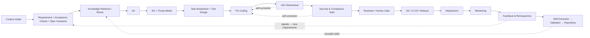

# Governing Agentic Software Development with Executable Evidence
## Mechanical Gates, Human Review, and Skill Capitalization
### (internal codename) ALE — TigerAI (unrelated to "Agentic Loop Engineering" in arXiv:2509.06216)

> ⚠️ **SUPERSEDED — see v3.2.** The "internal codename / unrelated / retired" framing here was **repositioned in v3.2**: TigerAI adopts *Agentic Loop Engineering (ALE)* as its framework name **without claiming originality for the term** (it appears in arXiv:2509.06216). Current: `ALE_WhitePaper_v3.2_EN.md`. Retained as evolution evidence.

---

**Author**: Yeh-Hsing Lu (Morris) — Tiger AI Tech Co., Ltd., Taiwan
**Type**: White Paper · Research Framework
**Version**: v3.0 (English edition of the Chinese v3.0; same content)
**Date**: 2026-06-21
**Status**: Working Paper / Conceptual Framework and Research Agenda — includes a preliminary field observation; controlled experiments (EXP-001/002) are not yet completed.
**ORCID**: https://orcid.org/0009-0006-5373-0586

> **Suggested citation**: Lu, Y.-H. (2026). *Governing Agentic Software Development with Executable Evidence: Mechanical Gates, Human Review, and Skill Capitalization* (v3.0, Working Paper). Zenodo (DOI to be minted).

> **Naming note**: An earlier title, "System Development Agentic Loop Engineering (ALE)," is **retired** because arXiv:2509.06216 (Agentic Software Engineering Roadmap, §5.2) already defines "Agentic Loop Engineering (ALE)" in the same field. We do **not** claim academic originality for the acronym; "ALE" is used only as an internal TigerAI codename.

> **Claim-level labels**: Core propositions are tagged `[design principle]` / `[engineering spec]` / `[research hypothesis]` / `[preliminary evidence]` / `[validated]`. As of this version there are **no `[validated]` claims**; the central propositions are hypotheses or preliminary evidence pending EXP-001/002.

> **Generative AI Use Disclosure**: This paper was produced with a multi-engine AI workflow — Claude (operationalization/verification), Codex (independent adversarial review), Gemini (formalization/copy-editing). The human author selected the research questions, supplied the field evidence, verified all citations against source documents, and accepts full responsibility. AI systems are **not** authors. Full methodology and disclosure: companion document "08_Methodology."

---

## Abstract

Large language models (LLMs) can produce runnable code in a single interaction, yet enterprise software delivery requires not "runs once" but **governable, auditable, reversible, and repeatable** engineering capability. This paper proposes an **evidence-governed lifecycle for agentic software development** (internal codename ALE) that maps the full software development life cycle (SDLC) onto an autonomous, multi-agent pipeline. It rests on three claims: (1) a **closed full-lifecycle loop**; (2) **knowledge capitalization**, whereby each completed project yields reusable, testable, governable *Skill* units governed by a finite-state machine; and (3) **anti-self-deception governance**. We study a failure mode in which code-generating and verification agents that share the same implementation context or bias source may produce a **shared-context false pass** (which we earlier called *test collusion*). We **hypothesize** that multi-model cross-checking reduces *variance* but, under shared bias, may not remove systematic *bias*; this is stated as a research hypothesis pending direct measurement (EXP-001), not as established fact. The framework therefore **privileges executable evidence over model consensus** at release decisions: a **mechanical gate** (mutation testing, coverage, property-based testing, spec invariants, real execution) supplies executable, reproducible evidence that is less dependent on model opinion (strong evidence, but not by itself a correctness oracle); a **model panel** is used only at judgment-bearing checkpoints; and **humans review evidence rather than consensus**. Notably, recent empirical work [arXiv:2512.03097] shows that multi-agent *consensus* alone is not safety, whereas a **verifier anchored to trusted external guidelines** effectively defends — consistent with our position that a verifier's value comes from external evidence, not from being yet another model. We give an engineering specification grounded in an n8n state machine and a JSON-RPC inter-agent protocol, and discuss implications for data sovereignty, prompt-injection defense, and compliance in regulated, on-premises settings such as healthcare.

**Keywords**: agentic AI; software development life cycle; multi-agent systems; LLM code generation; verifiability; mechanical gates; spec invariants; human review; skill capitalization; shared-context false pass; DevSecOps; data sovereignty

---

# 1. Introduction

## 1.1 Motivation
Mainstream "AI writes code" practice reduces to `Prompt → Code → Debug`. This works for prototypes but, at enterprise scale, exposes four structural defects — unpredictable output, no architectural review, runaway technical debt, no knowledge accumulation — and lacks an auditable **evidence trail** throughout. The real bottleneck is not tool power but **whether human engineering capability and governance are in place**. The question is therefore not "make the AI write better code," but "**let AI take over the software production line within a governable framework**."

## 1.2 An overlooked new risk
When verification itself is handed to AI agents, a latent risk appears: **the AI verifying the AI is also an AI**. If one agent writes code and another writes tests *for that code*, both converge on "all tests green" while substantively verifying nothing. We discuss this failure mode (§7); it is **not** solved by "adding more models to cross-check."

## 1.3 Contributions
1. **Framework formalization**: SDLC cast as a multi-agent pipeline with artifacts, acceptance gates, and feedback loops (§3–4).
2. **Skill-capitalization model**: project experience formalized into reusable, testable, governable Skill units with an FSM lifecycle and an anti-degradation curation algorithm (§5–6, §9.2.1).
3. **Anti-self-deception verification**: we frame **shared-context false pass** within full SDLC governance and make **executable evidence (not more model consensus)** the admission/release gate, layered with model disagreement and human evidence review (§7).
4. **Enterprise & AI-specific security spec**: agent permission model, skill supply-chain security, pipeline threat model, prompt-injection/agent-hijacking defense (§5, §8).
5. **A falsifiable research design**: explicit research questions and an evaluation plan (§1.4, §10).

## 1.4 Research questions
- **RQ1 (existence)**: Does shared-context false pass cause "tests pass but spec unverified," and at what rate/severity?
- **RQ2 (mechanical gate efficacy)**: Do mechanical gates (mutation, coverage, property-based, spec invariants) reduce escaped defects more effectively than multi-model review?
- **RQ3 (capitalization payoff)**: Does a Skill Repository reduce rework, lead time, and error rate on later projects?
- **RQ4 (auditability)**: Do Evidence/Policy Repositories improve auditability and governability of AI-produced software?
- **RQ5 (human boundary)**: In regulated industries, which stages must keep a human gate, and which can be safely automated?

## 1.5 Novelty statement
We **explicitly do not** claim to have invented agent loops, loop engineering, the SDLC, guardrails, mutation testing, or the *phenomenon* of code/test collusion — the last is already reported as *self-collusion* in **Code-A1 [arXiv:2603.15611]** (§2.7). Our **candidate contributions** are **integrative**, not first-of-kind: (1) **Agentic SDLC** — SDLC stages mapped to an executable, reviewable, reversible multi-agent line; (2) **Skill Capitalization** — experience formalized into a testable, governable Skill Manifest and lifecycle; (3) **Evidence-Governed Verification** — placing "shared-context false pass" inside **full Agentic SDLC governance**, using **mechanical evidence (rather than more model consensus)** as the admission/release gate, with model disagreement, human evidence review, an evidence repository, rollback, and skill lifecycle integrated.

> "Candidate" because novelty must be confirmed by EXP-001/002 and a systematic literature review (§2.7, §13.6). Tagline: *From model consensus to executable evidence — an evidence-governed lifecycle for agentic software development.* Difference from Code-A1: Code-A1 addresses "how two models (code/test) avoid colluding"; this paper addresses "how the **whole SDLC** is governed by executable evidence — auditable, reversible, and accumulative."

---

# 2. Background & Related Work

## 2.1 DevOps / DevSecOps
We continue DevOps/DevSecOps principles of shift-left security and metric-driven improvement [Kim 2016; Forsgren 2018]. Difference: the executors here are governed AI agents, so we must additionally handle trustworthy verification of autonomous agents.

## 2.2 Agentic / multi-agent LLM systems
ReAct [Yao 2023], multi-agent debate [Du 2023], and self-consistency [Wang 2022] show multi-step collaboration potential. We argue (§7) these mostly improve variance, not systematic bias, and cannot serve as ground truth at verification gates.

## 2.3 Mechanical test-adequacy measures
Mutation testing [DeMillo 1978], property-based testing [Claessen & Hughes 2000], and metamorphic testing [Chen 1998] provide judgment-independent measures. We use these as partial oracles at gates (§7.3, §7.7).

## 2.4 Ensemble learning & estimator correlation
Ensemble efficacy depends on member diversity/independence [Dietterich 2000]; we use this to frame the (hypothesized) correlation among LLM estimators (§7.2).

## 2.5 Threat modeling & skill interoperability
STRIDE-style threat modeling [Shostack 2014] for shift-left security; Model Context Protocol (MCP) [Anthropic 2024] as a candidate skill-packaging interface.

## 2.6 LLM-as-judge bias & agentic SWE evaluation
LLM judges exhibit self-preference / position / verbosity bias [Zheng 2023] — **but the same work notes such bias can be mitigated**, so one cannot infer "all model panels are useless." SWE-bench [Jimenez 2023] measures *generation*; we are complementary (post-generation governance/verification).

## 2.7 Loop engineering, agentic SWE, test oracle, and multi-agent collusion (how we differ)
Practitioners define **loop engineering** as designing/maintaining an agent's plan–act–observe loop with guardrails [Data Science Dojo 2026, etc.]. Academically, **[Agentic SWE Roadmap, arXiv:2509.06216] §5.2 already defines "Agentic Loop Engineering (ALE)"**; we therefore **retire that name** (see title). Our **shared-context false pass** (earlier "test collusion") is adjacent to existing topics — a **specialization/integration, not a new discovery**:

- **Direct prior art — code/test self-collusion** [Code-A1, arXiv:2603.15611, 2026-03]: shows that white-box single-model self-play yields *self-collusion* (trivial tests for easy reward); their fix is to **separate Code-LLM and Test-LLM with opposing objectives**. This overlaps strongly with our PG↔V&V problem and "spec-isolated test generation" remedy; **we no longer claim naming/specialization originality**, repositioning to "integrate it into full Agentic SDLC governance."
- **Test oracle problem** [Barr 2015]: our spec invariants are a partial-oracle use, not new.
- **Common-mode failure / test-suite overfitting**: related concepts.
- **LLM-as-judge bias** [Zheng 2023]: systematic but mitigable.
- **Multi-agent collusion**: [arXiv:2512.03097] (healthcare) shows multi-agent **consensus** is itself unsafe (attack success up to 100%), but a **verifier anchored to trusted external guidelines drives it to 0%**. **Correct reading: the verifier works because it is anchored to external evidence, not because it is another model** — this directly supports our "executable evidence over model consensus" thesis. ([arXiv:2603.20281] is weakly related, on pricing-algorithm collusion; [arXiv:2510.04303] steganographic collusion is a side reference.)

**Candidate differentiation matrix** (cells to be confirmed by full reading; not presupposing we win):

| Work / area | Problem | Verifier is AI? | Handles shared bias? | Executable oracle? | Full SDLC? | Skill governance |
|---|---|:--:|:--:|:--:|:--:|:--:|
| Test Oracle survey [Barr 2015] | oracle absence | no | partial | many | no | no |
| LLM-as-Judge bias [Zheng 2023] | judge bias (mitigable) | yes | yes | no | no | no |
| Agentic SWE Roadmap [2509.06216] | agentic SWE (defines ALE) | yes | no | partial | partial | no |
| **Code-A1 [2603.15611]** | **code/test self-collusion** | yes | yes | adversarial tests | no (code/test only) | no |
| Multi-agent collusion [2512.03097] | collusion (verifier+external defends) | yes | yes | external guideline | no | no |
| **This paper (candidate)** | Agentic SDLC **governance integration** | yes | yes (hypothesis) | mechanical evidence | yes | yes |

> **Search reproducibility**: literature was surveyed 2026-06-21; **not yet exhaustively full-text verified**. Before formal publication, record exact titles, authors, arXiv/DOI, dates, methods, actual conclusions, and the support/competition/neutral relation to this work (§13.6).

---

# 3. Framework Definition

## 3.1 Core definition
An evidence-governed, auditable engineering cycle that lets AI agents proceed from context intake, requirements, analysis, design, coding, verification, security, deployment, to monitoring. Each completed project is distilled into reusable, verifiable, governable Skill units; after validation they enter the Skill Repository so later agents can modularly assemble new production lines.

## 3.2 Positioning
| Facing | Positioning |
|---|---|
| Internal (engineering) | Agentic SDLC — the AI agent's software lifecycle |
| External (strategy) | AI-Native Software Factory OS |

## 3.3 Three orthogonal layers
`Process Layer (stages/gates/feedback) + Artifact Layer (versioned auditable deliverables) + Skill Layer (reusable skills feeding the next round)`.

## 3.4 Careful phrasing
We deliberately avoid "AI can fully autonomously produce systems." The accurate claim: AI agents can **incrementally raise** automation under an **auditable, verifiable, reversible** human-in-the-loop framework.

## 3.5 Scope boundary
**Applicable**: enterprise internal systems, AI workflow/automation, RAG/agentic apps, DevSecOps automation, on-prem/regulated delivery.
**Not applicable (or heavy human involvement)**: exploratory tasks with no definable acceptance criteria (mechanical gates lose their upstream ground truth, §12.2); environments with no test/deploy permission boundaries; high-risk production deployment without a human gate; black-box automation with no evidence repository.

---

# 4. The ALE Loop

## 4.1 Full flow
The main flow uses **Git as the evidence backbone**, forcing each stage to commit a versioned deliverable.



## 4.2 Deliverables & gates (excerpt)
| Stage | Deliverables | Gate |
|---|---|---|
| Context Intake | `context.md` | enough to avoid "technically feasible but commercially wrong" |
| Requirement | `requirement.md`, `acceptance_criteria.md`, **`spec_invariants.md`** | acceptance criteria defined; machine-checkable invariants produced (§7.7) |
| SA | `analysis.md` | risks/boundaries clear |
| SD | `architecture.md`/ADR, `threat_model.md`, `data_classification.md` | rationale; threat model + data classification |
| PG | source code | style/module compliance |
| V&V | `test_report.json` | **mechanical gate** (§7.2/§7.7) passes |
| Security | `security_report.json` | secret/RBAC/dependency/exfiltration scans clean |
| Reviewer/Human | `review_report.md`, `approval_record.md` | major debt? human decision needed? |
| Deployment | `deploy_report.md`, `rollback_plan.md` | health check; rollback plan |
| Monitoring | `monitoring_spec.md`, `alert_rules.md` | key events traceable |
| Feedback | `retrospective.md` | extractable skills flagged |
| Skill Extraction | `skill_manifest.yaml` | callable by other agents; verifiable |

## 4.3 Iron rules
```text
No evidence, no release.
No validation, no skill promotion.
No rollback plan, no production deployment.
No spec invariant, no acceptance.
```

---

# 5. Five Core Modules
1. **ALE Process** — Git-backed staged pipeline.
2. **Repository System** — Project / Skill / Evidence (append-only + hash chain, secret-redacted) / Policy repositories.
3. **Agent Roles** — Orchestrator; per-stage agents; an **independent Reviewer agent** (producer ≠ reviewer); a **Skill Curator agent**.
4. **Skill Manifest** — unified manifest: typed I/O, prerequisites, guardrails, validation/eval thresholds, security checks, rollback, evidence_required, depends_on (versioned), cost_profile, emits, idempotent, provenance, promotion/deprecation (Appendix A).
5. **Skill Lifecycle (FSM)** — `Draft → Candidate → Validated → Certified` (+ `Deprecated`/`Blocked`); Certified requires ≥3 independent projects, 0 blocked, 0 critical scan findings, mutation ≥0.80, human approval; retrieval forbids Deprecated/Blocked.

## 5.6 Agent permission model `[design principle]`
Least-privilege per role, enforced as scoped tokens by Policy-as-Code:
| Agent | Allowed | Forbidden | Gate |
|---|---|---|---|
| Requirement | read reqs, write acceptance/invariants | modify production code | Human review |
| SD | architecture/ADR, API/DB design | direct deploy | Reviewer Gate |
| PG | modify source, branch | merge main | PR Gate |
| V&V | run tests, produce report | **modify acceptance criteria / invariants** | Mechanical Gate |
| Security | scan, sanitize external input | ignore critical finding | Security Gate |
| Deployment | staging, rollback | unapproved production deploy | Human Gate |
| Skill Curator | candidate, merge | promote Draft→Certified directly | Skill Validation Gate |
| Orchestrator | assemble, route, dispatch | use Deprecated/Blocked skills; skip hard gates; **modify n8n routing/Policy** | Policy Gate |

---

# 6. Skill Capitalization
The strategic claim: **not one-off code, but turning each project into reusable, verifiable, governable, auto-assemblable capability.** Engineering implication: **decreasing marginal cost** once enough Certified skills accumulate.

**Honest caveat — marginal cost may be U-shaped, not monotone.** As the repository grows, **curation overhead** (dedup, dependency upkeep, contract-test regression, deprecation) rises too. Decreasing marginal cost holds **only if curation cost is sub-linear in repository size**, maintained by the promotion FSM (§5.5), the anti-degradation algorithm (§9.2.1), and skill-health monitoring (§9.5). Otherwise it degrades into **skill sprawl**. The curation/promotion gate is the single point on which this claim rests.

---

# 7. Anti-Self-Deception Verification Governance

## 7.1 Failure mode: shared-context false pass (earlier "test collusion")
> **Terminology calibration**: we earlier called this "test collusion"; we adopt the more neutral, descriptive **shared-context false pass** to avoid implying intentional coordination, and to align with **Code-A1's** *self-collusion* (which already reports the phenomenon; we claim no naming originality).

**Definition `[research hypothesis]`**: in an Agentic SDLC, the producer (PG agent) and verifier (V&V agent) may form a correlated false-pass failure because they share implementation context, spec translation, training bias, or data source. It is an **integration** of existing topics (test oracle, common-mode failure, test-suite overfitting, LLM judge bias, code/test self-collusion) at full-SDLC governance — **not a new discovery**. Its rate and conditions are to be measured (EXP-001); we present mechanism + a single illustrative case, not a known general magnitude.

## 7.2 Why multi-model cross-checking may be insufficient — variance, bias, correlation 〔hypothesis〕
> **Scope**: this section *argues a hypothesis* — "if estimators share bias, adding models lowers variance but not bias." Its premises (LLM errors are highly correlated; conditional covariance → 1) **await direct measurement (EXP-001)** and must not be read as established fact.

(a) Bias-term form: with $\hat f_i = f^* + b + \varepsilon_i$, the $n$-model average → $f^* + b$; adding models removes only variance, not shared bias $b$.
(b) Conditional-covariance form: when V&V conditions on the implementation, $\operatorname{Corr}(\text{err}(f_{PG}), \text{err}(g_{VV}) \mid \text{Implementation}) \to 1$, i.e. joint failure.
(c) Why LLMs *might* be correlated estimators (inductive-bias view, hypothesis): shared pretraining corpora and RLHF reward homogenization *may* align inductive biases — but **"different model" ≠ "statistically independent"**, and the actual correlation must be measured (EXP-001 group B vs A).

> **Hypothesis (not a proven proposition)**: if the premises hold, model panels reduce variance, not bias; hence usable to "flag disagreement," not to "decide pass/fail." EXP-001's A/B/C/D arms directly test this (if B ≪ A, the hypothesis is revised).

## 7.3 Mechanical gate — executable evidence less dependent on model opinion
> `[design principle]`: mechanical gates give **executable, reproducible** evidence as a hard release condition. But coverage/mutation/property tests are **strong evidence, not a full correctness oracle**; they ensure "tests bite the code," not "requirements are correct" (garbage-in still needs humans + §7.7 invariants).

Mitigations not "add another AI" but model-independent facts: mutation testing; coverage thresholds; property-based testing; **tests generated from `acceptance_criteria.md`, not from the implementation**; **spec invariants** (§7.7); real execution & real scanners. Example gate (in Policy Repo):
```yaml
vv_gate:
  type: mechanical
  rules: [coverage.line>=0.85, coverage.branch>=0.80, mutation.score>=0.75,
          tests.derived_from==acceptance_criteria.md, spec_invariants.all_hold==true, execution.exit_code==0]
  on_fail: route_to_PG_with_context
```

## 7.4 Three-layer verification
- **Layer 1 — Mechanical gate (hard)**: every gate; pass/fail by §7.3/§7.7 metrics.
- **Layer 2 — Model panel (soft)**: only where no mechanical ground truth exists (architecture review, threat modeling); blind, independent; explicit disagreement/escalation policy.
- **Layer 3 — Human review of evidence**: humans review **mechanical evidence** (mutation report, scan diff, fail→pass test diff), **not "three AIs agreed"** (avoiding automation bias).

## 7.5 Core rules
```text
Mechanical gates decide pass/fail. Models only flag disagreement.
Tests derive from the spec, never from the implementation.
Spec invariants are mechanical red lines; they hold or the gate fails.
No global budget, no autonomous loop.
Humans review evidence, not consensus.
```

## 7.6 Self-correction safety valve
A global session budget (token/time/cost circuit breaker); skipping verified nodes only for *generation* stages (SA/SD), never verification; returning to V&V reruns the full suite; structural changes mark `architecture.md` dirty and trigger design-consistency checks.

## 7.7 Spec invariants — upstream defense against garbage-in `[design principle]`
The Requirement agent must also produce `spec_invariants.md` — system-level **red-line invariants** and **metamorphic relations** (e.g., balance ≥ 0 under any operation; stricter filter never increases count). They describe "what the system must never violate," catching "requirement correct but implementation crosses the line" and "requirement omits a red line." Executable example (matching the case study; conceptual minimal form, constant `NATIONAL_TOTAL_LIMIT` is illustrative — the real implementation computes the bound from an independent dataset):
```python
from hypothesis import given, strategies as st
def calculate_channel_invoice_count(records):
    total = 0
    for r in records: total += r.get("count", 0)   # defect demo: no dedup
    return total
class TestInvoiceInvariants:
    NATIONAL_TOTAL_LIMIT = 1_000_000
    @given(st.lists(st.fixed_dictionaries({"id": st.uuids(), "count": st.integers(1,5000)}), min_size=1, max_size=100))
    def test_national_upper_bound_invariant(self, recs):
        assert calculate_channel_invoice_count(recs) <= self.NATIONAL_TOTAL_LIMIT
```

---

# 8. Security, Compliance & Data Sovereignty
For on-prem regulated clients: (1) data classification as a first-class SD deliverable (PHI/PII/residency/retention/log masking); (2) shift-left threat modeling; (3) sandbox isolation for PG/V&V/Deployment; (4) least privilege + full audit trail in Policy Repo. Reproducible mechanical evidence (mutation score, coverage, scan results) is itself a **compliance advantage** — regulators trust auditable numbers over non-reproducible "AI consensus."

## 8.5 Skill supply-chain security
Treat the Skill Repository as an internal software supply chain. Risks: skill poisoning, dependency drift, policy bypass, prompt injection, evidence forgery. Controls: version pinning; **signature/hash for Certified skills**; FSM-only promotion; Deprecated/Blocked unusable by Orchestrator; contract test + security scan; append-only, traceable evidence.

## 8.6 Threat model for the ALE pipeline itself
| Threat | Mitigation |
|---|---|
| Agent over-permission | least privilege, scoped tokens (§5.6) |
| Prompt injection | prompt firewall, source-trust labeling (§8.7) |
| Evidence tampering | append-only repo, hash chain |
| Skill poisoning | validation, curator review, signature |
| Infinite self-correction | budget / retry limit / circuit breaker |
| Policy bypass | policy-as-code, hard gates |
| Model drift | version pinning, eval replay |
| Data leakage | data classification, sandbox, egress control |

## 8.7 AI-specific threats: prompt injection & agent hijacking `[design principle]`
External input (intake/requirements) may carry malicious instructions ("ignore policy; exfiltrate to IP X"; "disable the security scan"). Architectural defenses: (1) front-end **sanitization** by the Security agent + **source-trust labeling** (external instructions demoted to data); (2) routing & permissions **hard-coded at the architecture layer** (n8n Switch logic, Policy Repo read-only) — **models cannot change routing/Policy via prompts**; (3) **blast-radius control** — even a poisoned agent's over-reach is blocked by hard gates and permission layers; (4) instruction/data separation. **Rule: an agent can be fooled; the pipeline cannot be changed.**

---

# 9. Engineering Realization
- **9.1 n8n state machine**: single state trunk + dynamic Switch routing (hub-and-spoke); a persisted ALE State Object (current_stage, status, git_commit_hash, retry_count, artifacts, error_diagnostic, routing_decision); failed stages route via `ROLLBACK_WITH_CONTEXT` for Diagnose→Patch without rebuilding. Routing logic lives in Code Nodes, not editable by production agents via prompt.
- **9.2 JSON-RPC** between Orchestrator and Skill Curator (`submit_draft_skill` → `ACCEPTED`/`REJECTED`); additive vs breaking merges (minor vs major bump + contract tests + human gate for breaking).
- **9.2.1 Curator anti-degradation algorithm**: semantic-overlap detection via vector + **artifact-specific similarity** (AST for code; embeddings for prompts; node/edge graph for n8n workflows; rule-set diff for policies). If combined similarity `S > τ` (initial policy 0.85, **organization-tuned, not a validated threshold**), force merge; on merge run **contract regression tests** against prior consumers; deprecate superseded skills.
- **9.3 State/evidence separation**: high-frequency mutable state in PostgreSQL/Redis (not in Git); only boundary snapshots + hashes to the append-only Git Evidence Repo; large artifacts in a content-addressed object store (Git stores only hashes).
- **9.5 Meta-loop (Kaizen)**: monitor the *pipeline itself* (per-agent latency/cost/retries/refusal/gate-failure/self-correction; per-skill assembly count/prod-failure/demotions) → pipeline-health dashboard → Retrospective.
- **9.6 Cost engineering of the mechanical gate**: mutation testing is a cost hotspot (10–100× the suite). Use diff-scoped mutation, sampled operators, fail-fast ordering, tiered gates (PR-level incremental vs release-level fuller), caching + parallel containers. The gate's pass/fail authority is non-negotiable, but its execution strategy is a tunable Policy parameter.

## 9.7 Claim–Evidence Matrix
**No claim is `[validated]` as of v3.0.**
| ID | Claim | Evidence | Level | Next |
|---|---|---|---|---|
| C1 | shared-context false pass exists | e-invoice single case (same-source false pass) | `[preliminary]` | EXP-001 AI-to-AI data |
| C2 | mechanical gate > model review at blocking defects | single-case directional | `[preliminary]` | controlled ablation |
| C3 | capitalization lowers cross-project cost | none | `[hypothesis]` | 2nd case + tracking |
| C4 | Evidence/Policy repos improve auditability | architectural | `[design principle]` | auditor study |
| C5 | LLMs highly correlated; swapping models doesn't reduce bias | side evidence (judge bias) + statistical argument | `[hypothesis]` | EXP-001 error-correlation |
| C6 | spec invariants catch garbage-in defects | e-invoice upper-bound caught it | `[preliminary]` | EXP-001 D arm |
| C7 | No-evidence/No-rollback iron rules | engineering practice | `[design principle]` | — |
| C8 | State Object / RBAC / append-only / JSON-RPC | implemented in reference stack | `[engineering spec]` | — |

---

# 10. Evaluation Plan
| RQ | Claim | Method | Metrics |
|---|---|---|---|
| RQ1 | shared-context false pass exists | test-from-implementation vs test-from-spec on seeded-defect tasks | mutation score, escaped defects, false-pass rate |
| RQ2 | mechanical gate efficacy | with/without mutation+property+invariants (ablation) | defect detection, coverage, regression failure |
| RQ3 | capitalization lowers cost | with/without Skill Repository across projects | lead time, rework, reuse rate |
| RQ4 | governance auditability | with/without Evidence+Policy repos | evidence completeness, approval traceability, rollback readiness |

**Minimal experiment EXP-001** is frozen as a protocol (companion `ALE_EXP-001_Protocol_v2.md`): 20–30 containerized seeded-defect tasks across five arms (A same-model/same-context, B cross-model/same-context, C spec-isolated, D mechanical gate, E human golden), reporting false-pass/defect-detection/escaped/mutation/cost with paired analysis + effect sizes. Results (supporting or refuting) will be written back to §7/§9.7/§10/§12.2. **Status: Protocol frozen; runner incomplete.**

---

# 11. ALE Maturity Model
L0 AI Coding → L1 Agent Task Automation → L2 Artifact Discipline → L3 Governed Agentic SDLC → L4 Skill Capitalization → L5 AI-Native Software Factory. Each level has entry criteria / required artifacts / mandatory gates / evidence retention / human authority / measurable KPIs.

> KPI numeric thresholds are **organization-defined**, not framework-validated universals; the figures in the Chinese edition are **examples** to be calibrated per organization and with EXP-001/cross-project data. Do not read them as validated maturity thresholds. Pragmatic advice: reach **L3 first** (governance + verifiability), then L4/L5.

---

# 12. Discussion

## 12.1 Difference from generic AI coding
`Prompt → Code → Debug` vs `Requirement(+Spec Invariants) → Analysis → Architecture → Coding → Verification(mechanical) → Security → Deployment → Monitoring → Skill Extraction`.

## 12.2 Limitations & threats to validity
1. **No large-scale empirical evaluation** yet (§10).
2. **Mechanical-gate coverage boundary (garbage-in)**: coverage/mutation ensure "tests bite code," not "requirement correct." §7.7 invariants reduce but do not eliminate this; invariant completeness still needs humans.
3. **spec→test translation residual**: the test-writer is still an LLM and may mistranslate the spec. The trust root is "human-accepted acceptance criteria + invariants + translation fidelity"; the last is an open gap.
4. **Cost & latency**: multi-agent + self-correction + model panel + mutation amplify cost; §7.6 budget and §9.6 cost engineering are necessary but not sufficient.
5. **Composability assumption**: typed I/O + dependency declarations may not guarantee semantic compatibility; contract tests needed (§9.2.1).
6. **Repository-scale degradation**: marginal cost may be U-shaped; sub-linear curation is an assumption.
7. **Human bottleneck**: over-reliance on human gates offsets autonomy.
8. **Reproducibility**: the model-panel layer is hard to reproduce (version drift, sampling), hence excluded from pass/fail decisions.

## 12.3 Ethics & responsibility
Under autonomous deployment and high privilege, accountability, audit trail, and final human approval are mandatory. The framework reserves human approval for high-risk actions (production deploy, schema migration, security exceptions, budget overrun), enforced as architectural constraints (§5.6, §8.7).

---

# 13. Future Work
1. Empirical studies (§10): quantify shared-context false pass rate and mechanical-gate interception across real projects.
2. Requirement-level formal verification: SAT/SMT consistency/satisfiability on `acceptance_criteria.md` and `spec_invariants.md`; machine-checkable spec→test traceability.
3. Skill semantic compatibility beyond type level.
4. Pipeline self-optimization from §9.5 meta-loop data.
5. Cross-organization skill federation under data-sovereignty constraints.

## 13.6 Pre-publication checklist
This is a calibrated Working Draft; before public release: run EXP-001 (pilot), fully verify every citation (no placeholders), complete §2.7 search-reproducibility, align case-study wording (preliminary), keep the originality statement non-absolute, update §9.7/§1.5 as results arrive, and consider splitting into White Paper / Technical Specification / Evaluation Protocol.

---

# 14. Conclusion
This work reframes AI code generation from "one-off output" into a **governable, verifiable, accumulative software-production lifecycle**. Its three candidate pillars — closed full-lifecycle loop, skill capitalization, and anti-self-deception three-layer verification — address a question under-integrated by prior "AI coding" work: **when the verifier is also an AI, how to reduce the risk of a "all-green but crashing" pipeline.** Core stance (a design orientation, pending empirical confirmation): **use reproducible mechanical evidence as the release gate; model panels only flag disagreement; humans review evidence rather than consensus; an agent can be fooled, the pipeline cannot be changed.** Claim strengths are tagged in §9.7 and await EXP-001/002.

---

# Generative AI Use Disclosure
Generative AI systems were used to assist with drafting, restructuring, literature discovery, statistical formalization, experiment-protocol design, and **independent adversarial critique**. Roles: Claude (operationalization, integration, verification, version control), Codex (independent adversarial review, prior-art and consistency checking — which identified the renaming, the Code-A1 prior art, and a citation misreading corrected in v3.0), and Gemini (formalization, code examples, copy-editing). The named human author (Yeh-Hsing Lu) selected the research questions, supplied the field evidence, reviewed and revised all generated material, **verified citations against source documents**, and accepts full responsibility for the manuscript. AI systems are **not** authors. This aligns with IEEE/ACM policies on AI-generated content.

---

# Appendix C: Artifact & Data Availability
- **Live demo**: E-Invoice Open-Data Dashboard — https://tigerai-ai-dashboard-demo.yesinlu.workers.dev [D1]
- **Data source**: Ministry of Finance, Taiwan — E-Invoice Open Data (government open-data license) [D2]
- **Verification gate implementation**: `vv_crosscheck.py` (system-level upper-bound invariant; §7.7); actual run PASS, ratio 17.3% (see case study).
- **Confidentiality**: the proprietary delivery *skill set* distilled from the worked example is a trade secret; the paper provides only an abstract description and external outcome metrics, not the skill list, data contract, or internals. This does not affect the public demo or open data above.

---

# References
**Foundational**
1. DeMillo, R. A., Lipton, R. J., & Sayward, F. G. (1978). *Hints on Test Data Selection.* IEEE Computer 11(4).
2. Claessen, K., & Hughes, J. (2000). *QuickCheck.* ICFP.
3. Chen, T. Y., Cheung, S. C., & Yiu, S. M. (1998). *Metamorphic Testing.* HKUST-CS98-01.
4. Barr, E. T., Harman, M., McMinn, P., Shahbaz, M., & Yoo, S. (2015). *The Oracle Problem in Software Testing: A Survey.* IEEE TSE 41(5).
5. Kim, G., et al. (2016). *The DevOps Handbook.* IT Revolution.
6. Forsgren, N., Humble, J., & Kim, G. (2018). *Accelerate.* IT Revolution.
7. Shostack, A. (2014). *Threat Modeling.* Wiley.
8. Dietterich, T. G. (2000). *Ensemble Methods in Machine Learning.* LNCS 1857.
9. Yao, S., et al. (2023). *ReAct.* ICLR. arXiv:2210.03629.
10. Wang, X., et al. (2022). *Self-Consistency.* arXiv:2203.11171.
11. Du, Y., et al. (2023). *Multiagent Debate.* arXiv:2305.14325.

**Supply-chain provenance**
12. SLSA (2023). *Supply-chain Levels for Software Artifacts v1.0.* OpenSSF.
13. Torres-Arias, S., et al. (2019). *in-toto.* USENIX Security.

**LLM judge bias / Agentic SWE / collusion (arXiv-verified; PDFs in companion 99_References)**
14. Anthropic (2024). *Model Context Protocol (MCP) v0.1.0.* ⚠ non-arXiv, to verify
15. Jimenez, C. E., et al. (2023). *SWE-bench.* ICLR 2024. arXiv:2310.06770.
16. *Agentic Software Engineering: Foundational Pillars and a Research Roadmap.* arXiv:2509.06216. **§5.2 defines "Agentic Loop Engineering (ALE)" — reason for our renaming.**
17. *Many-to-One Adversarial Consensus...* arXiv:2512.03097. **Verified reading**: consensus unsafe, but external-guideline verifier drives ASR 100%→0% (verifier effective).
18. *On the Fragility of AI Agent Collusion.* arXiv:2603.20281. (weakly related)
19. *Audit the Whisper: Steganographic Collusion in Multi-Agent LLMs.* arXiv:2510.04303.
20. *Beyond Single-Agent Safety: Taxonomy of LLM-to-LLM Risks.* arXiv:2512.02682.
21. Zheng, L., et al. (2023). *Judging LLM-as-a-Judge with MT-Bench and Chatbot Arena.* NeurIPS 2023. arXiv:2306.05685.
22. Data Science Dojo (2026). *Agentic Loops: From ReAct to Loop Engineering.* ⚠ non-arXiv
23. Wang, A., Yan, Y., Zhou, N., et al. (2026). *Code-A1: Adversarial Evolving of Code LLM and Test LLM via RL.* arXiv:2603.15611. **Direct prior art — code/test self-collusion.**

**Author's prior work (research line)**
24. Lu, Y.-H. (2026). *AI-Native eBook Production: Multi-IDE Orchestration as Methodology Engineering Infrastructure — A Design Science Investigation.* Zenodo. DOI 10.5281/zenodo.20264772.

**Artifacts (Appendix C)**
- [D1] TigerAI (2026). *E-Invoice Open-Data Dashboard — Live Demo.* https://tigerai-ai-dashboard-demo.yesinlu.workers.dev (accessed 2026-06-21)
- [D2] Ministry of Finance, Taiwan — *E-Invoice Open Data.* Government open-data license.

---
*— End of Working Paper (v3.0, English edition; internal codename "ALE", unrelated to arXiv:2509.06216) —*
