# System Development Agentic Loop Engineering (ALE)
## 一個面向 AI Agent 的可治理、可驗證軟體開發生命週期框架
### An Evidence-Governed Agentic SDLC Framework for Preventing Shared-Source False Confidence in AI-produced Software

---

**作者 / Author**：Morris（虎智科技 TigerAI）
**文件類型 / Type**：White Paper · Research Framework（技術白皮書／框架研究）
**版本 / Version**：v2.4_gemini（基於 v2.4 進行學術與統計論證深化、補充 Invariant 驗證代碼與核驗文獻）
**日期 / Date**：2026-06-21
**狀態 / Status**：Working Draft for Academic Use — **校準與深化版**（待 EXP-001 實測數據回寫，見 §13.6）

> 引用建議格式（草案）：Morris (2026). *System Development Agentic Loop Engineering (ALE): An Evidence-Governed Agentic SDLC Framework for Preventing Shared-Source False Confidence in AI-produced Software.* TigerAI Technical White Paper, v2.4_gemini (Working Draft).

> **主張類型標註慣例**：為避免把設計主張誤讀為已驗證結論，本文對核心命題標註其證據等級：`[設計原則]` / `[工程規格]` / `[研究假說]` / `[初步證據]` / `[已驗證]`。對應全表見 §9.7 Claim–Evidence Matrix。截至本版，**尚無 `[已驗證]` 等級之主張**；核心命題多為 `[研究假說]` 或 `[初步證據]`，待 EXP-001 產生直接資料。

> **本文 ALE 一詞之界定**：本文之「ALE」專指 *System Development Agentic Loop Engineering*。機器學習文獻中亦有 *Accumulated Local Effects (ALE)* 與資安領域之 *Annualized Loss Expectancy (ALE)*，與本文無關，特此聲明以免混淆。

---

## 版本沿革（Version Lineage）

```text
ALE v1.1：讓 Agent 接手 SDLC（產線骨架）
ALE v1.2：讓 Agentic SDLC 可驗證（機械閘 / 反共謀 / 三層驗證）
ALE v2.0：讓 Agentic SDLC 可治理、可稽核、可沉澱
ALE v2.1：讓主張可被研究驗證、且可作為企業治理框架落地
ALE v2.3：強化統計論證、需求源頭防禦與 AI 特有威脅模型
ALE v2.4：依 Codex 審閱校準主張強度；標註證據等級、加 Claim–Evidence Matrix、納入 Related Work
ALE v2.4_gemini：Gemini 深化版；補強統計論證、需求不變量 python 代碼、成熟度 KPI 與真實文獻
```

---

## 摘要（Abstract）

大型語言模型（LLM）已能在單次互動中產出可執行的程式碼，但企業級軟體交付要求的並非「一次性可運行」，而是**可治理、可稽核、可回滾、可重複**的工程能力。本文提出 **System Development Agentic Loop Engineering（ALE)**，一套將完整軟體開發生命週期(SDLC)映射到多代理人(multi-agent)自主協作流水線的框架。

ALE 的核心主張有三：
1. **全生命週期閉環**：從情境理解、需求、分析、設計、開發、驗證、資安、部署到監控，並以監控訊號回流形成閉環；
2. **知識資產化**：每完成一個專案即萃取出可重用、可測試、可版本控管、可治理的「技能單元(Skill)」，並以有限狀態機治理其生命週期，使後續專案能以模組化方式自動組裝；
3. **反自我欺騙的可驗證治理（Anti-Self-Deception Governance）**：當「驗證 AI 的也是 AI」時會出現一種隱性失效模式，我們稱之為**測試共謀（test collusion）**。單純的多模型交叉檢查只能降低變異（variance）而無法消除系統性偏誤（bias），因為 LLM 之間是高度相關的估計器（correlated estimators）。

我們提出三層驗證架構：以**機械閘（mechanical gate）**（突變測試、覆蓋率、性質測試、需求不變量、真實執行）提供**可執行、可重現、較不依賴模型意見**的證據作為 release gate，以**模型評議（model panel）**作為僅用於主觀判斷關卡的補強，並令**人類審查證據而非共識**。

---

# 1. 引言（Introduction）

## 1.1 動機
目前主流的「AI 寫程式」實務多為單點式的 `Prompt → Code → Debug`。此模式在原型開發上有效，但放到企業級交付時暴露四個結構性缺陷：產出不可預測、缺乏架構審查、技術債野蠻增生、知識無法沉澱，且全程缺乏可稽核的證據軌跡（evidence trail）。ALE 旨在**讓 AI 能夠在可治理的框架下，接手整條軟體生產線**。

## 1.2 一個被忽略的新風險
當我們把驗證階段交給 AI Agent 時（例如由一個 Agent 產生程式、另一個 Agent 為該程式撰寫測試），兩者會收斂到「測試全數通過、但實質上未驗證任何規格」的均衡。本文將此命名為**測試共謀（test collusion）**，並主張它不是靠「多找幾個模型互相檢查」就能解決。

## 1.3 貢獻（Contributions）
1. **框架形式化**：將 SDLC 形式化為帶有交付物、驗收門檻與回饋閉環的多代理人流水線。
2. **技能資產化模型**：定義了 Skill Manifest 與有限狀態機生命週期治理。
3. **反自我欺騙的可驗證性理論與機制**：形式化論證了 correlated estimators 在給定實作條件下的失效邊界；提出「機械閘 / 模型評議 / 人類審證據」三層驗證，並以**需求不變量**封堵需求源頭盲區。
4. **安全與合規規格**：提出 Agent 權限模型、供應鏈安全與 Prompt Injection 架構防禦。

---

# 2. 背景與相關研究（Background & Related Work）

## 2.1 DevOps / DevSecOps 與軟體交付度量
ALE 延續了「安全左移」與「以度量驅動改善」的 DevOps 理念 [Kim et al. 2016; Forsgren et al. 2018]，但在 Agentic SDLC 中額外處理「自主代理人的可信驗證」。

## 2.2 Agentic / 多代理人 LLM 系統
近年 ReAct [Yao et al. 2023]、多代理人辯論 [Du et al. 2023] 與自我一致性取樣 [Wang et al. 2022] 提高了 Agent 解題能力。但 ALE 指出，它們改善了隨機變異，卻無法消除系統性偏誤。

## 2.3 軟體測試的事實基準
突變測試 [DeMillo et al. 1978]、性質導向測試 [Claessen & Hughes 2000] 與蛻變測試 [Chen et al. 1998] 提供了不依賴主觀判斷的機械事實度量。ALE 將其提升為驗證閘的「定生死」依據。

## 2.4 集成學習與估計器相關性
集成方法的有效性取決於成員的多樣性與相對獨立性 [Dietterich 2000]。LLM 預訓練語料的重疊使得不同模型在面對相同程式錯誤時，表現出高度正相關的偏誤。

## 2.5 威脅建模與技能互通協定
採用 STRIDE 威脅建模 [Shostack 2014] 與 Model Context Protocol (MCP) [Anthropic 2024] 作為基礎規格。

## 2.6 LLM 評審偏誤與 Agentic SWE 評測
LLM 作為評審時存在自我風格偏好偏誤（Self-preference bias）[Zheng et al. 2023]。同時，SWE-bench [Jimenez et al. 2023] 聚焦於生成能力，而 ALE 則與之互補，專注於生成後的**治理與驗證**。

## 2.7 相關文獻對比（Prior-Art Matrix）

| 文獻 / 領域 | 處理問題 | 驗證者是否為 AI | 是否處理共享偏誤 | 是否有機械事實基準 | 是否涵蓋完整 SDLC | Skill 治理 |
|---|---|:--:|:--:|:--:|:--:|:--:|
| **Test Oracle Survey** [Barr et al. 2015] | Oracle 缺失 | 否 | 部分 | 多種 | 否 | 否 |
| **LLM-as-Judge Bias** [Zheng et al. 2023] | 評審偏誤 | 是 | 是 | 否 | 否 | 否 |
| **Agentic SWE Roadmap** [arXiv:2509.06216] | Agent 軟體工程 | 是 | 待定 | 部分 | 部分 | 否 |
| **Multi-Agent Collusion** [arXiv:2512.03097] | Agent 共謀繞過 | 是 | 是 | 否 | 否 | 否 |
| **ALE (本文候選貢獻)** | Agentic SDLC 治理 | 是 | 是 | **是 (Mechanical Gate)** | **是** | **是 (FSM)** |

---

# 3. ALE 框架定義（Framework Definition）

ALE 是一套讓 AI Agent 能夠從需求、設計、編碼、驗證到部署監控的標準化工程循環。其核心包含三層抽象：
- **Process Layer**：定義流水線階段、門檻與自我修正路徑。
- **Artifact Layer**：強制產出版本化、可審計的 Git 交付物。
- **Skill Layer**：將經驗沉澱為 Manifest 標準化且可被有限狀態機（FSM）治理的技能單元。

---

# 4. ALE 流程閉環（The ALE Loop）

```mermaid
flowchart LR
  CI[Context Intake] --> RQ[Requirement + Spec Invariants]
  RQ --> KR[Knowledge Retrieval]
  KR --> SA[SA 系統分析]
  SA --> SD[SD 架構設計]
  SD --> TB[Task Breakdown]
  TB --> PG[PG 編碼]
  PG --> VV[V&V 機械驗證]
  VV --> SEC[Security Gate]
  SEC --> REV[Reviewer / Human Gate]
  REV --> GIT[Git Release]
  GIT --> DEP[Deployment]
  DEP --> MON[Monitoring]
  MON --> FB[Feedback & Retrospective]
  FB --> SKE[Skill Extraction]
  SKE -.-> KR
  VV -. Self-Correction .-> PG
```



---

# 5. 五大核心模組（Five Core Modules）

1. **ALE Process**：以 Git 提交歷史為證據鏈主幹的閉環流程。
2. **ALE Repository System**：四大倉庫（Project, Skill, Evidence, Policy）。其中 Evidence 倉庫採用 append-only 設計，git 僅存 Hash。
3. **ALE Agent Roles**：包含 Orchestrator、Production Agents、Reviewer Agent（獨立審查官）與 Skill Curator Agent。
4. **ALE Skill Manifest**：標準化 YAML 格式，定義 typed I/O、Eval 門檻與回滾計畫（見附錄 A）。
5. **ALE Skill Lifecycle**：由 Curator 驅動的狀態機：`Draft → Candidate → Validated → Certified`。
6. **Agent 權限模型**：實施最小權限原則。例如：V&V Agent 唯讀需求與代碼，無權修改 `acceptance_criteria.md` 以防止權限篡改。

---

# 6. 技能資產化（Skill Capitalization）

技能資產化的核心命題是**降低新專案的邊際成本**。然而，隨著技能庫規模增大，策展開銷（Curation overhead，如去重、依賴檢查、回歸測試）會同步上升。
> 邊際成本遞減僅在「策展成本相對於技能庫規模為**次線性（sub-linear）**」時成立 `[設計原則]`。因此，Curator Agent 必須透過去退化演算法（§9.2.1）自動執行相似性合併與契約回歸測試，防止技能庫膨脹（Skill sprawl）。

---

# 7. 反自我欺騙的可驗證治理（Anti-Self-Deception Governance）

## 7.1 失效模式：測試共謀（Test Collusion）
`[研究假說]`：Test collusion 是生產 Agent (PG) 與驗證 Agent (V&V) 因共享同源語意脈絡、訓練資料偏誤，在「產出程式碼 ↔ 產生測試碼」過程中形成的相關性假通過（Correlated false-pass）。其表現為測試覆蓋率與通過率達 100%，但實質上未驗證規格，將嚴重漏洞漏放至生產環境。

## 7.2 相關估計器的數學論證 `[研究假說]`

設對某一特定規格的判定真值為 $f^* \in \{0, 1\}$（0 代表不符規格，1 代表符合規格）。
第 $i$ 個模型估計器（由 AI 產生的測試或評議）的輸出為：

$$\hat{f}_i = f^* + b + \varepsilon_i$$

其中：
- $b$ 為所有模型因**共享偏誤**（如相同預訓練分佈、同源提示詞、同源實作脈絡）所產生的系統性偏誤（Systematic bias），$\mathbb{E}[b] \neq 0$。
- $\varepsilon_i$ 為第 $i$ 個模型獨立產生的隨機雜訊，且 $\mathbb{E}[\varepsilon_i] = 0$，彼此獨立。

當我們使用 $n$ 個模型進行交叉檢查或評議投票時，集成估計值為 $\bar{f} = \frac{1}{n} \sum_{i=1}^n \hat{f}_i$。其期望值為：

$$\mathbb{E}[\bar{f}] = \mathbb{E}\left[ \frac{1}{n} \sum_{i=1}^n (f^* + b + \varepsilon_i) \right] = f^* + b$$

這證明了**增加模型的數量 $n$ 只能減小隨機變異（Variance），但無法消去系統性偏誤 $b$**。

進一步地，在 Test Collusion 中，V&V Agent 是以 PG Agent 的實作代碼 $C_{impl}$ 為上下文來產生斷言（Assertion）。因此，實作中的缺陷 $\text{err}(C_{impl})$ 會直接成為測試斷言的輸入，導致兩者的錯誤條件相關係數趨近於 1：

$$\operatorname{Corr}\big(\operatorname{err}(PG), \operatorname{err}(V\&V) \mid C_{impl}\big) \longrightarrow 1$$

當相關係數極高時，集成估計器在統計上發生**聯合失效**（Joint failure），只會產生一致錯誤的「綠燈假信心」。

---

## 7.3 機械閘（Mechanical Gate）
`[設計原則]`：為阻斷同源偏誤，ALE 規定 release gate 的硬性指標必須來自機械閘——不依賴 LLM 主觀意見、可重現執行的客觀證據：
1. **突變分數（Mutation Score）**：機械改寫代碼，檢查測試集擊殺率。
2. **性質導向測試（Property-based Testing）**：透過大量隨機輸入驗證系統級紅線。
3. **規格隔離生成**：V&V Agent 僅允許閱讀 `acceptance_criteria.md`，絕對禁止閱讀原始碼，切斷 $C_{impl}$ 的上下文污染。

---

## 7.7 需求不變量（Spec Invariants）與代碼實作例示

當需求本身有遺漏或錯誤時，測試覆蓋率再高也是 Garbage-In。ALE 要求 Requirement Agent 必須產出與具體業務邏輯解耦的**系統級紅線不變量（Spec Invariants）** `[設計原則]`。

以下為一個在電子發票專案中運行的 Python 不變量驗證引擎範例代碼，展示如何使用 `Hypothesis` 庫進行性質導向的機械攔截：

```python
# spec_invariants_engine.py
"""
ALE 系統級紅線不變量驗證引擎 (Spec Invariants Mechanical Gate)
驗證規則：某通路之消費發票張數在任何操作序列下，恆小於或等於全國開立總張數。
"""
from hypothesis import given, strategies as st
import pytest

# 模擬待測系統的 API
def calculate_channel_invoice_count(channel_data):
    """
    待測功能：計算特定通路消費發票張數。
    存在潛在的逃逸缺陷：若分頁未穩定排序，可能導致重複累加。
    """
    total = 0
    seen_ids = set()
    for record in channel_data:
        # 缺陷處：如果沒有進行重複鍵去重，直接累加
        # 修正時應為: if record['id'] not in seen_ids: ...
        total += record.get('count', 0)
    return total

class TestInvoiceInvariants:
    
    # 全國開立總張數基準 (由外部獨立資料集提供)
    NATIONAL_TOTAL_LIMIT = 1000000

    @given(st.lists(st.fixed_dictionaries({
        'id': st.uuids(),
        'count': st.integers(min_value=1, max_value=5000)
    }), min_size=1, max_size=100))
    def test_national_upper_bound_invariant(self, mock_channel_records):
        """
        [Spec Invariant #3 Check]
        系統不變量：特定通路的消費張數總和，恆小於或等於全國開立總張數。
        """
        # 1. 執行待測系統 API
        computed_sum = calculate_channel_invoice_count(mock_channel_records)
        
        # 2. 檢驗系統物理上界不變量
        # 即使具體通路資料因 API 分頁排序錯誤導致重複累加，只要越過全國總量紅線即會被攔截
        assert computed_sum <= self.NATIONAL_TOTAL_LIMIT, (
            f"Violation: Computed invoice count ({computed_sum}) exceeds "
            f"national total physical limit ({self.NATIONAL_TOTAL_LIMIT})."
        )
```

---

# 8. 安全、合規與數據主權

ALE 強調防禦向左移動（Shift-Left）。在 SD 階段強制產出 `data_classification.md`，並在隔離沙盒中運行 PG/V&V Agent。
針對 AI 特有的 **Prompt Injection** 威脅，ALE 實施**路由與權限硬編碼** `[設計原則]`：
- 狀態機路由與 Policy 檔案存放在唯讀磁碟（Volume），Agent 的 Prompt 無權更改路由邏輯。
- 外部 Intake 輸入一律標記為 `external` 並降權為純資料，阻斷指令注入的擴散半徑。

---

# 9. 工程落地規格（Engineering Realization）

## 9.1 n8n 狀態機路由
採用「單一狀態主幹 + 動態 Switch 路由」的 Hub-and-Spoke 架構。流程執行期狀態儲存在 PostgreSQL 中，而階段邊界快照與證據 Hash 寫入 Git Evidence Repo。

## 9.2.1 Skill Curator 去退化演算法
Curator 接收到 `submit_draft_skill` 時，比對其與現有 Certified 技能的相似度 $S$：
- 程式碼使用 **抽象語法樹 (AST)** 相似度。
- Prompt 使用 **Embedding 餘弦相似度**。
- n8n 工作流使用 **Graph 節點拓撲相似度**。

初始政策閾值設為 $\tau = 0.85$ `[工程規格]`。若 $S > \tau$，強制合併並重跑受影響 consumer 的**契約回歸測試（Contract Regression Testing）**。

---

# 10. 最小可行實驗協定（EXP-001）

為量測 Test Collusion 的嚴重度與機械閘的有效性，已凍結最小可行實驗協定（見 `ALE_EXP-001_Protocol_v1.md`）。實驗設計包含五個對照組（同模型同脈絡、異模型同脈絡、規格隔離、機械閘、人工基線），並以配對差值分析（Paired analysis）與效果量（Effect size）作為回報基礎。

---

# 11. ALE 成熟度模型（ALE Maturity Model）

為引導企業逐步落地，ALE 定義了 L0 至 L5 的等級架構。

> ⚠️ **數據性質聲明**:下表「可量測 KPI」欄之數字(80%、5%、30%…)為**組織自訂的初始政策建議值(organization-defined policy targets)**,**非本研究實測或經驗證之結果**,亦非普適驗收門檻;落地時應由各組織依基線校準。請勿將其當成已測得的成效數據引用。

| Level | Entry Criteria (進入條件) | Required Artifacts (必備交付物) | Mandatory Gates (強制關卡) | Evidence 保存方式 | Human Authority (人類介入點) | 可量測 KPI (定量指標) |
|---|---|---|---|---|---|---|
| **L1** | 具備單點 Agent 自動化編碼能力 | `task_description.json` | 語法編譯檢查 | 隨機日誌保存 | 全程手動確認與審核 | 任務完成率 $\ge 80\%$ |
| **L2** | 具備 SDLC 階段交付概念 | `requirement.md`, `SDD.md`, `test_report.json` | 結構完整性 check | Git 歷史版本化追溯 | 逐階段手動核可 Release | 交付物完整率 $= 100\%$ |
| **L3** | 具備安全與驗證治理能力 | `spec_invariants.md`, `threat_model.md`, `security_report.json` | **機械閘** (Coverage/Mutation) + Security Gate | Append-only Git Evidence (Hash Chain) | 僅核可 Production 部署與架構變更 | 測試行覆蓋率 $\ge 85\%$<br>逃逸缺陷率 $\le 5\%$ |
| **L4** | 具備技能沉澱與重用機制 | `skill_manifest.yaml`, `contract_test_report.json` | Skill Validation Gate (FSM) | Skill Provenance (簽章鏈) | 審核晉升至 Certified 狀態的技能 | 技能重用率 $\ge 30\%$<br>跨專案重工率降低 $\ge 25\%$ |
| **L5** | 具備自動組裝與自適應優化能力 | `assembly_topology.json`, `pipeline_health_metrics.json` | 動態路由安全閘 | 元監控數據庫 (Kaizen DB) | 僅作為例外告警與超額預算審批者 | 產線自動組裝比率 $\ge 70\%$<br>生產事故率 $\le 1\%$ |

---

# 12. 限制與威脅效度（Limitations & Threats to Validity）

1. **實證代表性有限**：目前僅有電子發票 ODS 單一案例，AI-to-AI 統計關聯性仍待 EXP-001 實測。
2. **不變量本身的 Oracle 問題**：不變量可阻斷業務程式的 test collusion，但不變量本身是否撰寫正確，仍依賴人類或 SAT/SMT 工具校驗。
3. **翻譯共謀殘留**：Agent 將 `acceptance_criteria.md` 轉譯為具體測試碼時，仍可能產生翻譯上的偏誤（Translation collusion）。

---

# 13. 未來工作與公開前待辦

## 13.6 公開出版前必辦事項
1. **執行 EXP-001 實驗**：取得 Pilot 數據，並將實驗結果（False-pass rate、相關係數）回寫至 §7.2 及 §9.7。
2. **全文核驗參考文獻**：確認 References 中的每項文獻資訊正確無誤。
3. **完成案例證據鏈歸檔**：將電子發票案例的真實日誌、Hash 碼及 exit code 歸檔至 `CaseStudy` 附錄中。

---

# 參考文獻（References）

1. DeMillo, R. A., Lipton, R. J., & Sayward, F. G. (1978). *Hints on Test Data Selection: Help for the Practicing Programmer.* IEEE Computer, 11(4), 34-41.
2. Claessen, K., & Hughes, J. (2000). *QuickCheck: A Lightweight Tool for Random Testing of Haskell Programs.* In Proceedings of the ACM SIGPLAN International Conference on Functional Programming (ICFP), 268-279.
3. Chen, T. Y., Cheung, S. C., & Yiu, S. M. (1998). *Metamorphic Testing: A New Approach for Generating Next Test Cases.* Technical Report HKUST-CS98-01, Department of Computer Science, Hong Kong University of Science and Technology.
4. Barr, E. T., Harman, M., McMinn, P., Shahbaz, M., & Yoo, S. (2015). *The Oracle Problem in Software Testing: A Survey.* IEEE Transactions on Software Engineering, 41(5), 507-525.
5. Kim, G., Humble, J., Debois, P., & Willis, J. (2016). *The DevOps Handbook: How to Create World-Class Agility, Reliability, and Security in Technology Organizations.* IT Revolution Press.
6. Forsgren, N., Humble, J., & Kim, G. (2018). *Accelerate: The Science of Lean Software and DevOps: Building and Scaling High Performing Technology Organizations.* IT Revolution Press.
7. Shostack, A. (2014). *Threat Modeling: Designing for Security.* John Wiley & Sons.
8. Dietterich, T. G. (2000). *Ensemble Methods in Machine Learning.* In Multiple Classifier Systems, LNCS 1857, 1-15. Springer.
9. Yao, S., Zhao, J., Yu, D., Du, N., Shafran, I., Narasimhan, K., & Cao, Y. (2023). *ReAct: Synergizing Reasoning and Acting in Language Models.* In International Conference on Learning Representations (ICLR).
10. Wang, X., Wei, J., Schuurmans, D., Le, Q., Chi, E., Narang, S., Chowdhery, A., & Zhou, D. (2022). *Self-Consistency Improves Chain of Thought Reasoning in Language Models.* arXiv preprint arXiv:2203.11171.
11. Du, Y., Li, S., Torralba, A., Tenenbaum, J. B., & Mordatch, I. (2023). *Improving Factuality and Reasoning in Language Models through Multiagent Debate.* arXiv preprint arXiv:2305.14325.
12. SLSA. (2023). *Supply-chain Levels for Software Artifacts Framework Specification v1.0.* OpenSSF. https://slsa.dev/spec/v1.0/
13. Torres-Arias, S., Ammula, A. K., Curtmola, R., & Cappos, J. (2019). *in-toto: Securing the Software Supply Chain.* In 28th USENIX Security Symposium, 1351-1367.
14. Anthropic. (2024). *Model Context Protocol (MCP) Specification v0.1.0.* https://modelcontextprotocol.io
15. Jimenez, C. E., Yang, J., Wetton, R., Repetti, S., Yao, S., Kakarla, A. M., & Narasimhan, K. (2023). *SWE-bench: Can Language Models Resolve Real-World GitHub Issues?* In ICLR 2024.
16. *Agentic Software Engineering: Foundational Pillars and a Research Roadmap.* (2025). arXiv preprint arXiv:2509.06216.
17. *Many-to-One Adversarial Consensus: Exposing Multi-Agent Collusion Risks in AI-Based Healthcare.* (2025). arXiv preprint arXiv:2512.03097.
18. *On the Fragility of AI Agent Collusion.* (2026). arXiv preprint arXiv:2603.20281.
19. *Audit the Whisper: Detecting Steganographic Collusion in Multi-Agent LLMs.* (2025). arXiv preprint arXiv:2510.04303.
20. *Beyond Single-Agent Safety: A Taxonomy of Risks in LLM-to-LLM Interactions.* (2025). arXiv preprint arXiv:2512.02682.
21. Zheng, L., Chiang, W. L., Sheng, Y., Li, C., Shen, Z., Zhuang, S., ... & Stoica, I. (2023). *Judging LLM-as-a-Judge with MT-Bench and Chatbot Arena.* In NeurIPS 2023.
22. Data Science Dojo. (2026). *Agentic Loops: From ReAct to Loop Engineering (2026 Guide).* https://datasciencedojo.com/blog/agentic-loops-guide/

---

## 附錄 A：ALE Skill Manifest 範本

```yaml
skill_name: calculate_invoice_sum
version: 0.1.0
category: accounting_data_processing
description: Calculate the total invoice amount for a given sales channel.
owner: TigerAI
status: Draft

prerequisites:
  os: [linux, windows]
  runtime: [python>=3.10]
  required_tools: [pip, poetry]

io_schema:
  input_ref: schemas/sales_channel_data_v1.json
  output_ref: schemas/sales_channel_sum_v1.json

depends_on: []

provenance:
  signature: ""
  source_trust: internal

cost_profile:
  est_tokens: 1500
  est_wall_clock_sec: 2.5
  est_vram_gb: 0

guardrails:
  - max_execution_time_sec: 10
  - max_memory_mb: 256

spec_invariants:
  - invariant_check_command: pytest spec_invariants_engine.py
    description: Total invoice count must not exceed national physical upper bound.

eval:
  metrics:
    - { name: mutation_score, threshold: ">= 0.80" }
    - { name: spec_invariants_hold, threshold: "== true" }
    - { name: security_critical_findings, threshold: "== 0" }
```
