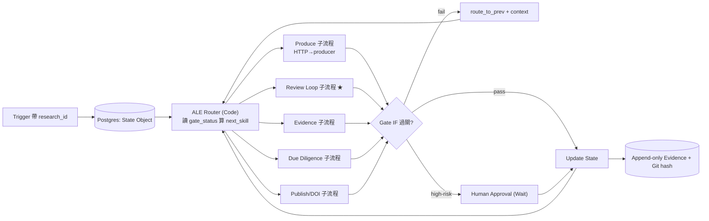

# 08 · 用 n8n 把 A2A Skill Set 掛成研究生產流程（教學級 · n8n 大使版)

> **用途**:大學課程教材。把 `A2A_SKILLSET.md` 的每個 skill(階段+gate)掛成 **n8n workflow**,讓「3×AI 寫論文」這條線**可一鍵跑、可斷點續傳、可稽核**。
> **設計原則**:單一狀態主幹 + 動態 Switch 路由(Hub-and-Spoke;白皮書 §9.1)。
> **守密 / 誠實**:模型呼叫一律 **HTTP Request → 通用 OpenAI 相容端點**(`OPENAI_BASE_URL`),不綁特定服務;通知節點 **stub**;全程 **Docker 可帶走**;商業機密 skill set 內部不編排、不揭露。

---

## 🎓 教學設計（給授課老師)

**學習目標(學生跑完能做到)**
1. 說出 stage-gate + 「生產者≠審查者 + 證據>共識」為何能防止 AI 自我背書。
2. 在 n8n 裡用 **State Object + Router(Code)+ Gate(IF)** 做出可斷點續傳的流程。
3. 把「對抗式審查微迴圈」實作成平行 HTTP + Merge + 查證 + 迴圈。
4. 辨識並處理三個真實踩坑(schedule trigger / healthcheck / 憑證 id)。

**先備**:Docker、n8n 基本操作、一個 OpenAI 相容端點(**沒有也能上課**——用 stub 節點)。
**時數建議**:① 概念 30 min → ② 匯入最小 workflow 跑通 30 min → ③ 加一個 gate / 加一個 reviewer(練習)60 min。

---

## 1. 為什麼用 n8n(課堂第一張投影片)
- **stage-gate 視覺化**:每個 gate = 一個 IF 節點,過不過一眼看到。
- **斷點續傳**:狀態存 DB,某關失敗從該關重跑。
- **天然稽核**:每節點 execution 留痕 = evidence trail。
- **組合不重造**:AI 呼叫 / 人類核可 / Git 提交都是現成 node。
- 我們是 n8n 大使 → 這條線本身就是 n8n 的能力展示。

---

## 2. 總體拓樸（已修正,可渲染)



---

## 3. Skill → n8n 節點對映(課堂講義表)

| A2A skill | n8n 節點 | gate(IF 條件) |
|---|---|---|
| s00/s01/s02 produce | HTTP Request(→producer)+ Set | 章節完整/證據等級已標(G1/G2) |
| **s03 review_loop ★** | 見 §5 | 意見收斂 + 造假已攔(G3) |
| s04 evidence | Execute Command(容器跑實驗)/ HTTP | 有實測數據(G4) |
| s05 due_diligence | HTTP(檢索)+ Code(矩陣) | 引文核驗+新穎性(G5) |
| s06 publication | HTTP(Zenodo API)+ Set | DOI+metadata 一致(G6) |
| s07 lessons | Postgres Insert | — |
| 狀態/路由 | Postgres + Code(Router) | — |
| 證據 | Postgres(append-only)+ Execute Command(git hash) | — |
| 人類關卡 | Wait(webhook/Form) | 高風險動作 |

---

## 4. 課堂 Lab:匯入「最小可跑 workflow」(零 API key 也能跑)

把下面存成 `research_pipeline_min.json`,在 n8n **Import from File** 匯入。它用 **Set 節點當 AI stub**,所以**不用任何金鑰就能跑通**,專心理解 State→Router→Gate 的骨架;之後把 stub 換成 HTTP Request 即接真模型。

```json
{
  "name": "ResearchPipeline_Min",
  "nodes": [
    { "parameters": {}, "id": "n1", "name": "Manual Trigger",
      "type": "n8n-nodes-base.manualTrigger", "typeVersion": 1, "position": [0, 300] },
    { "parameters": { "jsValcode": "" , "mode": "runOnceForAllItems",
        "jsCode": "// 初始化 State Object\nreturn [{ json: { state: {\n  research_id: 'demo-001',\n  draft_version: 'v0',\n  gate_status: { G1:'pending', G2:'pending', G3:'pending', G4:'blocked' },\n  open_findings: 1\n} } }];" },
      "id": "n2", "name": "Init State", "type": "n8n-nodes-base.code", "typeVersion": 2, "position": [220, 300] },
    { "parameters": { "jsCode": "// ALE Router:找第一個未過的 gate\nconst s = $json.state;\nconst order = ['s02_draft','s03_review_loop','s04_evidence','s05_due_diligence','s06_publication'];\nconst gate = { s02_draft:'G2', s03_review_loop:'G3', s04_evidence:'G4', s05_due_diligence:'G5', s06_publication:'G6' };\nconst next = order.find(k => s.gate_status[gate[k]] !== 'pass') || 'done';\nreturn [{ json: { ...$json, next_skill: next } }];" },
      "id": "n3", "name": "ALE Router", "type": "n8n-nodes-base.code", "typeVersion": 2, "position": [440, 300] },
    { "parameters": { "assignments": { "assignments": [
        { "id": "a1", "name": "state.draft_version", "value": "v1", "type": "string" } ] } },
      "id": "n4", "name": "Produce (stub→換 HTTP)", "type": "n8n-nodes-base.set", "typeVersion": 3.4, "position": [660, 200] },
    { "parameters": { "jsCode": "// Review Loop stub:reviewer+enhancer 給 finding,Verify 後標 verified→關閉\nconst s = $json.state;\ns.open_findings = 0;            // 查證屬實並修正後收斂\ns.gate_status.G3 = 'pending';  // 交給 Gate IF 判定\nreturn [{ json: { ...$json, state: s } }];" },
      "id": "n5", "name": "Review Loop (stub)", "type": "n8n-nodes-base.code", "typeVersion": 2, "position": [660, 400] },
    { "parameters": { "conditions": { "options": { "caseSensitive": true }, "conditions": [
        { "id": "c1", "leftValue": "={{ $json.state.open_findings }}", "rightValue": 0, "operator": { "type": "number", "operation": "equals" } } ], "combinator": "and" } },
      "id": "n6", "name": "Gate G3 (IF)", "type": "n8n-nodes-base.if", "typeVersion": 2, "position": [880, 400] },
    { "parameters": { "jsCode": "const s=$json.state; s.gate_status.G3='pass'; return [{json:{...$json,state:s}}];" },
      "id": "n7", "name": "Update State (pass)", "type": "n8n-nodes-base.code", "typeVersion": 2, "position": [1100, 340] },
    { "parameters": {}, "id": "n8", "name": "Back to Router (fail)", "type": "n8n-nodes-base.noOp", "typeVersion": 1, "position": [1100, 480] }
  ],
  "connections": {
    "Manual Trigger": { "main": [[{ "node": "Init State", "type": "main", "index": 0 }]] },
    "Init State":     { "main": [[{ "node": "ALE Router", "type": "main", "index": 0 }]] },
    "ALE Router":     { "main": [[{ "node": "Produce (stub→換 HTTP)", "type": "main", "index": 0 }, { "node": "Review Loop (stub)", "type": "main", "index": 0 }]] },
    "Review Loop (stub)": { "main": [[{ "node": "Gate G3 (IF)", "type": "main", "index": 0 }]] },
    "Gate G3 (IF)":   { "main": [ [{ "node": "Update State (pass)", "type": "main", "index": 0 }], [{ "node": "Back to Router (fail)", "type": "main", "index": 0 }] ] }
  }
}
```

**跑法**:Import → 開啟 → Execute Workflow → 點每個節點看 `state` 怎麼被改;`Gate G3 (IF)` 兩條線(true=pass / false=回 Router)就是 stage-gate 的精神。
> 課堂提問:把 `Review Loop (stub)` 的 `s.open_findings = 0` 改成 `1`,再跑一次——Gate 會走哪條線?(答:fail→回 Router,示範「沒收斂不准過」。)

---

## 5. ★ 核心:Review Loop 子流程(對抗審查 + 查證)

把 stub 換成真的:這是整套價值所在——**生產者≠審查者 + 查原始來源**。

```text
[draft_vN]
   ├─(平行)→ HTTP Request: reviewer 端點(MODEL_REVIEWER) → findings_R
   └─(平行)→ HTTP Request: enhancer 端點(MODEL_ENHANCER) → findings_E
        ▼ Merge(R+E)
   ★ Verify 節點(不盲信 AI)★
     - finding 指「文獻誤讀」→ HTTP 抓 PDF/arXiv → 比對
     - finding 指「程式/數據假」→ Execute Command 容器跑真實程式 → 比對
     - 產 verified(屬實) / rejected(造假或讀錯→寫 07_Lessons)
        ▼ HTTP: producer 套用 verified → draft_vN+1(升版號)
   IF 收斂?(open_findings==0 且 無過度宣稱)
     - 否 → 迴圈再審一輪
     - 是 → 出 G3
```
**用 n8n 強制的機械紅線(IF/Code)**:`MODEL_PRODUCER != MODEL_REVIEWER`;`finding.verified==true 才可關閉`;`fabricated==true 一律駁回並記錄`。→ 這就是把白皮書 §7 三層驗證變成節點。

HTTP Request 節點設定(reviewer 範例):
```
Method: POST
URL: ={{ $env.OPENAI_BASE_URL }}/chat/completions
Authentication: Header Auth(Authorization: Bearer {{ $env.OPENAI_API_KEY }})
Body(JSON): { "model": "={{ $env.MODEL_REVIEWER }}", "temperature": 0,
  "messages": [ {"role":"system","content":"You are an adversarial reviewer. Find overclaims, missing citations, misreadings."},
                {"role":"user","content":"={{ $json.draft }}"} ] }
```

---

## 6. ALE Router(Code Node 完整版)
```javascript
const s = $json.state;
const order = ["s00_ideas","s01_consolidation","s02_draft","s03_review_loop",
               "s04_evidence","s05_due_diligence","s06_publication"];
const gates = {s02_draft:"G2", s03_review_loop:"G3", s04_evidence:"G4",
               s05_due_diligence:"G5", s06_publication:"G6"};
let next = order.find(k => !(gates[k] && s.gate_status[gates[k]] === "pass"));
if (s.gate_status.G4 !== "pass" && s.preprint_ready) next = "s06_publication_preprint"; // 預印本分支
return [{ json: { next_skill: next, research_id: s.research_id } }];
```

---

## 7. 環境與部署（Docker 可帶走)
`.env`(不入 git):
```env
OPENAI_BASE_URL=https://your-openai-compatible-endpoint/v1
OPENAI_API_KEY=...
MODEL_PRODUCER=...     # 角色一:操作化/整合
MODEL_REVIEWER=...     # 角色二:對抗審查(須 ≠ producer)
MODEL_ENHANCER=...     # 角色三:形式化/潤稿
BUDGET_TOKENS=500000  # 全域 circuit breaker
```
部署:
```bash
docker exec n8n n8n import:credentials --input=creds.json   # 憑證 JSON 帶顯式 id
docker exec n8n n8n import:workflow   --input=research_pipeline_min.json
# healthcheck 用 127.0.0.1(避 IPv6 假性 unhealthy)
```

---

## 8. ⚠ 三個真實踩坑(課堂一定要教)
1. **schedule trigger 不能被 CLI execute** → smoke 測試改用 **manual-trigger 變體**。
2. **healthcheck 用 `127.0.0.1` 不要用 `localhost`** → localhost 可能解析到 IPv6 `::1`,n8n 只在 IPv4 → 假性 unhealthy。
3. **匯入憑證/工作流的 JSON 必帶顯式 `id`** → 否則 import 後連不上、要手接。
> (延伸)通知節點預設 **stub**:只組訊息不真送,報告誠實標,不謊報已寄送。

---

## 9. 學生練習（作業 / 評分)
| # | 練習 | 學到 |
|---|---|---|
| A | 把 `Review Loop` 的 finding 改成「未收斂」,觀察 Gate 走 fail 回 Router | stage-gate 迴圈 |
| B | 新增一個 **G4 Evidence Gate**:沒有 `measured_results` 就擋住 | 「No evidence, no release」 |
| C | 把 Produce stub 換成真 **HTTP Request → OpenAI 相容端點** | A2A 真接模型 |
| D | 加 **Wait 節點**做人類核可,發表前必停 | human-in-the-loop |
| E | 加一個 **第二 reviewer 端點**,Merge 兩家意見 | 生產者≠審查者 / 多引擎 |

**評分 rubric(建議)**:State 正確流轉 30% · Gate 邏輯正確 30% · Review 迴圈含查證 25% · 誠實邊界(stub/人類關卡)15%。

---

## 10. 一句話收束(下課投影片)
> n8n 不是來「自動生論文」的。它是把**「多個 AI 互相對抗 + 人類查證 + 過關才往下」**這套紀律,變成**看得見、跑得動、留得下痕跡**的流程。**這就是 ALE 白皮書 §7/§9 的可執行版。**

---
*配套:`A2A_SKILLSET.md`(技能定義)、`PROCESS_FLOWCHART.md`(流程圖)、白皮書 §9(n8n 狀態機規格)。本流程編排「研究生產」,與商業 skill set 內部無關。*
