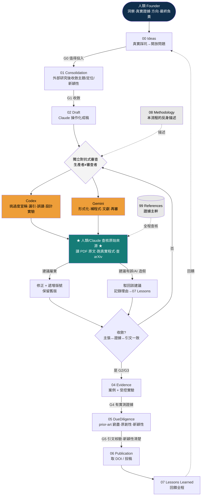

# 08 · 方法論流程圖（3×AI + 人類 寫論文的完整流程)

> 這是把**本研究真實走過的過程**抽象成的可重複流程圖。核心不是「AI 幫你寫」,而是**「多個獨立 AI 互相對抗審查、人類查核原始證據並負最終責任」**——與 ALE 框架同構(證據 > 共識)。
> 對應角色與定位見 `README.md`;真實踩坑見 `../07_Lessons_Learned/`。

---

## A. 一眼版（ASCII 高層流程)

```text
        ┌─────────────────────────────────────────────────────────────┐
        │  人類(Founder):洞察、真實證據、方向、最終決策、負全責            │
        └─────────────────────────────────────────────────────────────┘
                 │ 提出問題 / 真實案例(如:踩到的坑)
                 ▼
   [00 Ideas] ──► [01 Consolidation] ──► [02 Draft (Claude 操作化)]
                                              │
                                              ▼
                      ┌──────────  微迴圈(關鍵)  ──────────┐
                      │  Claude 草稿                          │
                      │      │                                │
                      │      ▼                                │
                      │  獨立對抗式審查                        │
                      │   ├─ Codex(挑過度宣稱/漏引/誤讀)      │
                      │   └─ Gemini(形式化/補強/再審)         │
                      │      │  審查意見(可能含 AI 自己的錯)   │
                      │      ▼                                │
                      │  ★ 人類/Claude 查核「原始來源」 ★      │  ← 不盲信任何 AI
                      │   (讀 PDF 原文、跑真實程式、查 arXiv)  │
                      │      │                                │
                      │   ┌──┴── 屬實?                        │
                      │   │是→ 修正 + 遞增版號(保留舊版)       │
                      │   │否→ 駁回該建議(記錄理由)            │
                      │      │                                │
                      └──────┼── 未收斂 → 再跑一輪 ────────────┘
                             │ 收斂(主張↔證據↔引文一致)
                             ▼
   [03 Reviews 存軌跡] ─► [04 Evidence 實驗/案例(過 G4)] ─►
   [05 DueDiligence prior-art/原創性] ─► [06 Publication DOI] ─►
   [07 Lessons 回饋] ↺   (08 Methodology 描述本流程;99 References 證據主幹)
```

---

## B. 完整版（mermaid;可渲染成圖)



---

## C. 每個節點 = 我們真的做了什麼(對照)

| 流程節點 | 本研究真實事件 |
|---|---|
| 00 Ideas | 電子發票案踩到「同源假通過」4.5x 膨脹 → 變研究種子 |
| 01 Consolidation | 查 agenticloops repo、loop engineering、collusion 文獻 → 收斂定位 |
| 02 Draft(Claude) | v2.0 → v2.1 → v2.3 → v2.4 → v2.5 → v3.0 逐版操作化 |
| 對抗審查(Codex) | 兩輪:① 降過度宣稱/補引文 ② DOI 前審抓出 3 個 P0 |
| 對抗審查(Gemini) | 深化(統計/Python/KPI)+ 第二輪獨立確認同 3 個 P0 |
| ★ 查核原始來源 ★ | 讀 2512.03097 PDF、抓 2509.06216 §5.2、抓 Code-A1 → **確認 AI 指控屬實** |
| 駁回 | Gemini 案例研究的**虛構稽核日誌** → 查核否決,改真實輸出 |
| 修正+版號 | 每次另存新版、保留舊版(v2.0…v3.0) |
| 04 Evidence | 電子發票案 + EXP-001(共謀)/EXP-002(技能迴圈)協定 |
| 05 DueDiligence | prior-art 矩陣、原創性聲明、新穎性/價值評估 |
| 06 Publication | venue 研究、DOI 指南、Zenodo 上傳包、中英 PDF |
| 07 Lessons | 7 則踩坑(誤讀/撞名/漏 prior-art/AI 造假/ORCID…) |

---

## D. 三條鐵則(這流程能成立的關鍵)
```text
1. 生產者 ≠ 審查者:草稿與審稿用不同 AI 引擎(避免自我背書)。
2. 證據 > 共識:AI 的審查/數據/日誌一律「查原始來源」才採信(讀 PDF、跑程式、查 arXiv)。
3. 人類負最終責任:AI 不列作者;主張強度標證據等級,過頭就降級。
```
> 這三條 = ALE 白皮書 §7 的「機械閘/模型評議/人類審證據」用在**寫論文**上。論文的生產流程,本身就是 ALE 的活案例。
